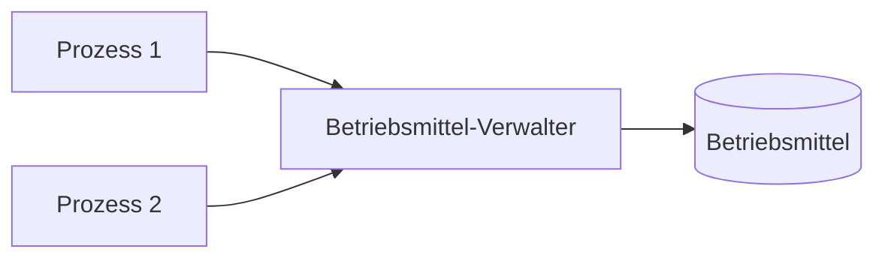
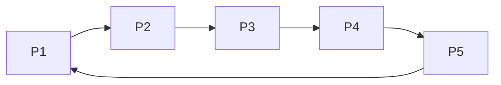
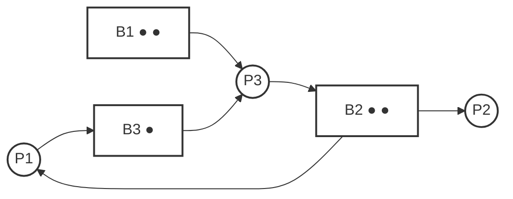

**Class:** [[SysProg - Systemprogrammierung]]  
**Date:** 28-05-2026  
**Topics:** #Betriebsmittelverwaltung #Verklemmung #BankierAlgorithmus  
**Link:** [[VL.05 SysProg.pdf]]

***

## 🎯 Lernziele der Vorlesung

Diese Vorlesung behandelt, wie Betriebsmittel im Betriebssystem verwaltet werden, warum unkoordinierte Nutzung Probleme erzeugt und wie Verklemmungen erkannt, beschrieben und vermieden werden können.

- **Betriebsmittel verstehen**: Was Ressourcen sind und warum sie knapp sind.
- **Verwaltungsmodelle unterscheiden**: zentrale Verwaltung, Verständigung, unkoordinierte Nutzung.
- **Betriebsmittel klassifizieren**: real, logisch, virtuell sowie wiederverwendbar vs. verbrauchbar.
- **Auswahlstrategien analysieren**: First-Fit, Best-Fit, Verhungerungsproblem.
- **Deadlocks modellieren**: Wartegraph, notwendige Bedingungen, Betriebsmittelgraph.
- **Verklemmungen vermeiden**: sichere/unsichere Zustände und Banker-Algorithmus.
- **Praktische Reaktion auf Deadlocks**: Prozesse abbrechen, zurücksetzen oder Betriebsmittel entziehen.

***

## 1. Einführung in Betriebsmittel

### Definition

Ein **Betriebsmittel** oder eine **Ressource** ist alles, was ein Prozess als Aktivitätsträger in einem System zum Vorankommen benötigt.

$$\boxed{\text{Betriebsmittel} = \text{alles, was ein Prozess für Fortschritt benötigt}}$$

**Beispiele für Akteure:**
- Benutzer.
- Prozess.
- Thread.

**Beispiele für Betriebsmittel:**
- Prozessor.
- Speicher.
- Bandbreite.
- Datei.
- Signal.
- Nachricht.
- Name.
- Farbe.

> [!info] **Kernaussage**
> Betriebsmittel sind problematisch, wenn sie knapp sind oder nicht gleichzeitig benutzt werden können.

### Warum Verwaltung nötig ist

Betriebsmittel werden oft exklusiv benutzt. Ohne Koordination können sich Prozesse gegenseitig stören oder Daten zerstören. Deshalb ist eine Verwaltung sinnvoll.

**Typische Probleme ohne Verwaltung:**
- Vermischte Ausgaben beim Drucken.
- Konflikte bei gleichzeitigem Zugriff.
- Unkontrollierte Kollisionen.

> [!example] **Intuition**
> Ein Drucker ist kein „gleichzeitig für alle“ nutzbares Gut. Ohne Verwaltung würden zwei Prozesse ihre Ausgaben vermischen.

### Unkoordinierte Nutzung

Bei unkoordinierter Nutzung können unerwünschte Effekte auftreten, etwa Chaos durch gleichzeitige Zugriffe.

**Beispielidee:**
- Prozess X druckt Zeilen.
- Prozess Y druckt gleichzeitig andere Zeilen.
- Das Ergebnis wird unlesbar.

> [!warning] **Achtung**
> Unkoordinierte Nutzung ist nur dann vertretbar, wenn Kollisionen selten und reparabel sind.

***

## 2. Modelle der Betriebsmittelverwaltung

### Zentrale Instanz

Bei dieser Lösung entscheidet eine zentrale Instanz, wer das Betriebsmittel erhält. Das ist vergleichbar mit Ampeln oder Schranken im Straßenverkehr.

$$\boxed{\text{Zentrale Verwaltung} = \text{Nutzung nur nach vorheriger Belegung}}$$

**Beispiele:**
- Hauptspeicherverwaltung.
- Monitor/Mutex-artige Zugriffssteuerung.
- Drucken über Treiber.

**Rolle:**
- Der Betriebsmittel-Verwalter klammert die Nutzung ein.
- Erst wird belegt, dann benutzt, dann freigegeben.

### Verständigung der Teilnehmer

Die Prozesse stimmen sich durch Regeln oder Protokolle ab. Das ist die dezentrale Variante.

**Beispiele:**
- Kritischer Abschnitt mit Sperren.
- Dezentrale Bus-Arbitrierung.
- Verteilte Systeme mit Broadcast und logischer Zeit.

$$\boxed{\text{Verständigung} = \text{Koordination durch Regeln, Verhandlung oder Protokolle}}$$

> [!note] **Merkhilfe**
> Hier gibt es keinen „Chef“, sondern alle Teilnehmer halten sich an ein Protokoll.

### Unkoordinierte Nutzung als dritte Lösung

Hier gibt es keinerlei Maßnahmen zur Abstimmung. Das spart Aufwand, kann aber Kollisionen verursachen.

**Einsatz nur dann sinnvoll, wenn:**
- Kollisionen selten sind.
- Kollisionen reparabel sind.
- Der Aufwand für permanente Koordination zu hoch wäre.

**Beispiele:**
- Optimistische Synchronisation von Transaktionen.
- Kollisionsbehaftete Protokolle wie Ethernet.

> [!tip] **Merksatz**
> Erst wenn Kollisionen billiger sind als Vermeidung, lohnt sich unkoordinierte Nutzung.

***

## 3. Klassifikation von Betriebsmitteln

### Real, logisch, virtuell

Betriebsmittel lassen sich in drei Klassen einteilen.

| Klasse | Bedeutung | Beispiel |
|---|---|---|
| **Real** | physisch existent | CPU, Speicher, SSD, GPU |
| **Logisch** | Abstraktion eines realen BM | Datei, Fenster |
| **Virtuell** | mehr Exemplare werden vorgetäuscht als real vorhanden | virtueller Speicher, virtuelle Verbindung |

$$\boxed{\text{Logisches BM} = \text{Abstraktion eines realen BM}}$$
$$\boxed{\text{Virtuelles BM} = \text{vorgespiegelte Mehrzahl eines realen BM}}$$

**Rolle der logischen Betriebsmittel:**
- komfortablere Schnittstelle,
- funktional angereichert,
- vom Betriebssystem verwaltet.

### Persistenz

**Wiederverwendbar:** Nach der Nutzung wird das Betriebsmittel freigegeben und kann erneut verwendet werden.

**Verbrauchbar:** Bei Nutzung wird das Betriebsmittel „verbraucht“ und existiert danach nicht mehr als dasselbe Objekt.

$$\boxed{\text{Verbrauchbar} = \text{nach einmaliger Nutzung nicht mehr vorhanden}}$$

### Kapazität

**Begrenzt:** Das Betriebsmittel muss bewirtschaftet werden.

**Unbegrenzt:** Verwaltung ist weitgehend unnötig, allenfalls An- und Abmelden einer Nutzung.

> [!info] **Intuition**
> Ein begrenztes BM verhält sich wie ein Parkplatz; ein unbegrenztes eher wie ein Online-Formular, das mehrere Nutzer gleichzeitig bedienen kann.

***

## 4. Auswahlstrategien bei knappen Ressourcen

### Grundidee

Wenn nicht alle Anforderungen gleichzeitig erfüllt werden können, braucht das Betriebssystem eine Auswahlstrategie.

**Begriffe:**
- $nf(t)$: freie BM-Einheiten zum Zeitpunkt $t$.
- $n(i)$: benötigte BM-Einheiten von Prozess $i$.
- $W(t)$: Warteschlange der Anforderungen.

$$\boxed{\text{Ziel} = \text{gute Auslastung} + \text{faire Behandlung}}$$

### First-Fit-Request

Die Warteschlange wird von vorne durchsucht, bis die erste erfüllbare Anforderung gefunden wird.

**Regel:**
$$n(i) \leq nf(t)$$

### Best-Fit-Request

Die Warteschlange wird vollständig durchsucht und die Anforderung gewählt, die die Restkapazität minimiert.

$$\boxed{\text{Best Fit} = \arg\min_{j \in W(t),\, n(j)\le nf(t)} \bigl(nf(t)-n(j)\bigr)}$$

### Iterative Anwendung

Die Strategien werden so lange angewendet, bis keine Belegung mehr möglich ist.

| Strategie | Vorteil | Nachteil |
|---|---|---|
| First Fit | schnell | kann große Anforderungen benachteiligen |
| Best Fit | gute Ausnutzung | teurer durch Vollsuche |

### Starvation / Verhungern

Bei First Fit und Best Fit können Prozesse mit großen Anforderungen sehr lange warten.

$$\boxed{\text{Starvation} = \text{ein Prozess wird trotz Fortschritt des Systems dauerhaft benachteiligt}}$$

### Fenster dynamischer Größe

Um Verhungern zu vermeiden, wird ein Fenster mit dynamischer Breite verwendet.

**Idee:**
- Initialbreite $L_{max}$.
- Nach jeder erfolgreichen Belegung wird das Fenster kleiner.
- Spätestens nach $L_{max}-1$ Zugriffen gilt $L=1$.
- Dann muss die vorderste Anforderung berücksichtigt werden.

$$
L =
\begin{cases}
L-1, & \text{falls } L>1 \text{ und die erste Anforderung nicht berücksichtigt wurde} \\
L_{max}, & \text{sonst}
\end{cases}
$$

> [!warning] **Achtung**
> Ohne Begrenzung der Fensterbreite können große Anforderungen praktisch „hinten verschwinden“.

***

## 5. Verklemmung und Wartegraph

### Definition Deadlock

Eine Verklemmung ist eine Situation, in der Prozesse sich gegenseitig blockieren und deshalb nicht weiter ausgeführt werden können.

$$\boxed{\text{Deadlock} = \text{dauerhafte Blockierung ohne Fortschritt}}$$

**Praktische Folgen:**
- Operationen stoppen dauerhaft.
- Das System macht keinen Fortschritt.
- Blockierte Prozesse und Threads bleiben hängen.

### Wartegraph

Ein **Wartegraph** ist ein gerichteter Graph:
- Knoten = Prozesse.
- Kante $P_i \to P_j$ bedeutet: $P_i$ wartet auf eine Ressource von $P_j$.

$$\boxed{\text{Deadlock im Wartegraphen} \Leftrightarrow \text{Zyklus}}$$

> [!info] **Merkhilfe**
> Ein Kreis im Wartegraphen bedeutet: Jeder wartet auf jemanden, der selbst wartet.

### Notwendige und hinreichende Bedingungen

Für das Auftreten einer Verklemmung müssen vier Bedingungen erfüllt sein:

1. **Beschränkte Belegung (mutual exclusion)**  
   Ein BM ist exklusiv belegt oder frei.

2. **Zusätzliche Belegung (hold-and-wait)**  
   Prozesse halten bereits Ressourcen und verlangen weitere.

3. **Keine vorzeitige Rückgabe (no pre-emption)**  
   Ressourcen können nicht zwangsweise entzogen werden.

4. **Gegenseitiges Warten (circular wait)**  
   Es existiert eine geschlossene Kette wartender Prozesse.

$$\boxed{\text{Deadlock} \Rightarrow \text{mutual exclusion} + \text{hold-and-wait} + \text{no pre-emption} + \text{circular wait}}$$

> [!failure] **Wichtig**
> Circular wait ist die hinreichende Bedingung; die ersten drei sind notwendig, aber allein nicht ausreichend.

***

## 6. Betriebsmittelgraph

### Definition

Ein Betriebsmittelgraph stellt Anforderungs- und Belegungssituationen formal dar.

Sei $P$ die Menge der Prozesse und $BM$ die Menge der Betriebsmitteltypen. Dann ist ein gerichteter Graph $(V,E)$ mit $V = P \cup BM$ ein Betriebsmittelgraph.

**Pfeilsemantik:**
- $(p,b) \in E$: Prozess $p$ fordert eine Einheit von BM-Typ $b$.
- $(b,p) \in E$: Prozess $p$ besitzt eine Einheit von BM-Typ $b$.

$$\boxed{\text{Betriebsmittelgraph} = \text{gerichteter bipartiter Graph aus Prozessen und Betriebsmitteln}}$$

### Eigenschaften

- Der Graph ist bipartit.
- Punkte im BM-Knoten geben die Anzahl verfügbarer Einheiten an.
- Ein Zyklus weist auf eine potenzielle Verklemmung hin.
- Jede Operation verändert den Graphen durch Hinzufügen oder Entfernen von Kanten.

| Operation  | Graphänderung                       |
| ---------- | ----------------------------------- |
| Anfordern  | Kante von Prozess zu BM             |
| Belegen    | Kante von BM zu Prozess             |
| Freigeben  | Kante entfernen                     |
| Beendigung | alle belegten BM werden freigegeben |

### Reduzierbarkeit

Ein BM-Graph ist **reduzierbar**, wenn ein Prozess existiert, dessen Anforderungen sofort erfüllbar sind und dessen Kanten entfernt werden können.

Ein BM-Graph ist **vollständig reduzierbar**, wenn sich alle Kanten durch eine Reduktionsfolge entfernen lassen.

$$\boxed{\text{Verklemmung} \Leftrightarrow \text{BM-Graph nicht vollständig reduzierbar}}$$

> [!tip] **Intuition**
> Wenn man immer wieder einen „fertig machbaren“ Prozess entfernen kann, ist das System sicher. Wenn irgendwann keiner mehr geht, steckt man fest.

***
 
## 7. Verklemmungsvermeidung

### Theoretischer Ansatz

Um Verklemmungen zu vermeiden, muss das Betriebssystem den aktuellen Zustand kennen und die Restanforderungen der Prozesse berücksichtigen.

**Ziel:**
- eine Belegungsstrategie finden, die keinen Wartezyklus erzeugt, und eine sichere Beendigungsreihenfolge garantiert.

$$\boxed{\text{Sicherer Zustand} = \text{es existiert eine Reihenfolge, in der alle Prozesse fertig werden können}}$$

### Unsichere Betriebsmittelsituation

Eine Situation ist **unsicher**, wenn zwar aktuelle Anforderungen noch erfüllbar sein können, aber bei ungünstiger Reihenfolge eine Verklemmung möglich ist.

> [!warning] **Achtung**
> Unsicher heißt nicht sofort deadlock, aber die spätere Verklemmung ist möglich.

### Bankier-Algorithmus

Der **Bankier-Algorithmus** von Dijkstra prüft, ob ein Zustand sicher ist.

**Analogie:**
Eine Bank gibt Kredite nur dann aus, wenn sie noch genug Geld behält, um mindestens einen Kunden vollständig zu bedienen. Der bediente Kunde zahlt zurück, dadurch werden wieder Ressourcen frei.

$$\boxed{\text{Bankier-Algorithmus} = \text{Sicherheitsprüfung durch simuliertes Fertigwerden von Prozessen}}$$

### Ablauf des Algorithmus

1. Wähle einen noch nicht terminierten Prozess $P_i$ mit $r_i \le f$.
2. Simuliere seine Bedienung und Terminierung.
3. Addiere seine belegten Ressourcen zum freien Vektor $f$.
4. Wiederhole das, bis:
    - alle Prozesse terminieren können $\Rightarrow$ sicher,
	- oder kein weiterer Prozess bedient werden kann $\Rightarrow$ unsicher.

$$\boxed{\text{Freie Ressourcen nach Schritt } k: \; f := f + b_i}$$

### Beispiel

Gegeben sind vier Prozesse und zwei BM-Typen mit:

Belegungen $B=\begin{pmatrix}0&4\\1&0\\3&0\\5&4\end{pmatrix}$
Gesamtanforderungen $G=\begin{pmatrix}4&6\\2&4\\3&1\\10&6\end{pmatrix}$

freie Betriebsmittel $f=(3,2)$

Daraus ergeben sich die Resantforderungen $R$ und die vorhandenen $BM$

Restanforderungen $R=\begin{pmatrix}4&2\\1&4\\0&1\\5&2\end{pmatrix}$

vorhandene Betriebsmittel $v=(12,10)$

**Sichere Reihenfolge:**
$P_3 \rightarrow P_1 \rightarrow P_2 \rightarrow P_4$

> [!success] **Ergebnis**
> Das System ist im Beispiel sicher, weil alle Prozesse in einer geeigneten Reihenfolge fertig werden können.

***

## 8. Praxis bei Deadlocks

### Realität

In der Praxis sind Restanforderungen oft nicht bekannt, also treten Deadlocks trotz Vorsicht auf. Dann muss das Betriebssystem reagieren.

**Typische Reaktionen:**
- Deadlock erkennen.
- Eine Aktion ausführen, um das System wieder lauffähig zu machen.

### Reaktionsmöglichkeiten

| Maßnahme | Idee | Risiko |
|---|---|---|
| Prozesse abbrechen | einen geeigneten Prozess stoppen | Datenverlust |
| Prozesse zurücksetzen | auf letzten Checkpoint zurücksetzen | Inkonsistenzen |
| Betriebsmittel entziehen | Ressourcen zwangsweise wegnehmen | nur für manche BM-Arten möglich |

$$\boxed{\text{Praxis} = \text{Erkennen + gezielte Reparatur}}$$

> [!danger] **Achtung**
> Jede Reparatur kann Datenverluste oder Inkonsistenzen verursachen.

***

## 📌 Zusammenfassung

### Wichtige Konzepte

| Konzept | Bedeutung |
|---|---|
| **Betriebsmittel** | knappe Ressource, die Prozesse benötigen |
| **Verwaltung** | kontrollierte Belegung, Nutzung, Freigabe |
| **Deadlock** | gegenseitige Blockierung ohne Fortschritt |
| **Wartegraph** | grafische Darstellung von Wartebeziehungen |
| **Betriebsmittelgraph** | formale Modellierung von Anforderung und Belegung |
| **Sicherer Zustand** | es gibt eine Beendigungsreihenfolge ohne Verklemmung |
| **Bankier-Algorithmus** | prüft Sicherheit durch Simulation |

### Kernaussagen

- [p] **Betriebsmittel sind knapp** und müssen deshalb verwaltet werden.
- [p] **Koordination** kann zentral, dezentral oder ganz ohne Abstimmung erfolgen.
- [p] **Verklemmungen** entstehen durch zyklisches Warten bei exklusiven Ressourcen.
- [p] **Betriebsmittelgraphen** machen Ressourcenlage formal analysierbar.
- [p] **Bankier-Algorithmus** vermeidet Deadlocks, indem nur sichere Zustände erlaubt werden.
- [!] **Achtung:** In der Praxis kennt man Restanforderungen oft nicht vollständig.
- [c] **Falsch:** Ein Zyklus im Ressourcen-Graphen ist nicht immer schon ein Deadlock, sondern erst ein Warnsignal.

### Wichtige Formeln / Regeln

| Formel                        | Bedeutung                                 |
| ----------------------------- | ----------------------------------------- |
| $n(i) \le nf(t)$              | Anforderung ist erfüllbar                 |
| $\vec{x} \le \vec{y}$         | komponentenweise Vergleichbarkeit         |
| $\vec{a}_i \not\le \vec{f}$   | Prozess ist blockiert                     |
| $\sum_i b_{ij} \le v_j$       | es gibt nicht mehr Belegung als vorhanden |
| $\vec{R} = \vec{G} - \vec{B}$ | Restanforderung                           |
| Deadlock                      | nicht vollständig reduzierbarer BM-Graph  |

***

## 🔗 Verbindungen zu anderen Vorlesungen

- [[VL.04 Koordination nebenläufiger Prozesse]]: Kritische Abschnitte, Sperren und gegenseitiger Ausschluss.
- [[VL.06 Speicher- und Adressraumverwaltung]]: Speicherverwaltung, Paging und Verdrängungsstrategien als weiterer Ressourcenbereich.
- [[VL.07-Betriebssysteme]]: Einordnung der Deadlock-Behandlung im Kernel.
- [[VL.08-Verteilte Systeme]]: Logische Zeit, Protokolle und dezentrale Koordination.

### Fußnoten
[^1]: Die Verklemmungsvermeidung ist theoretisch elegant, aber in der Praxis oft nur eingeschränkt nutzbar, weil zukünftige Anforderungen unbekannt sind.