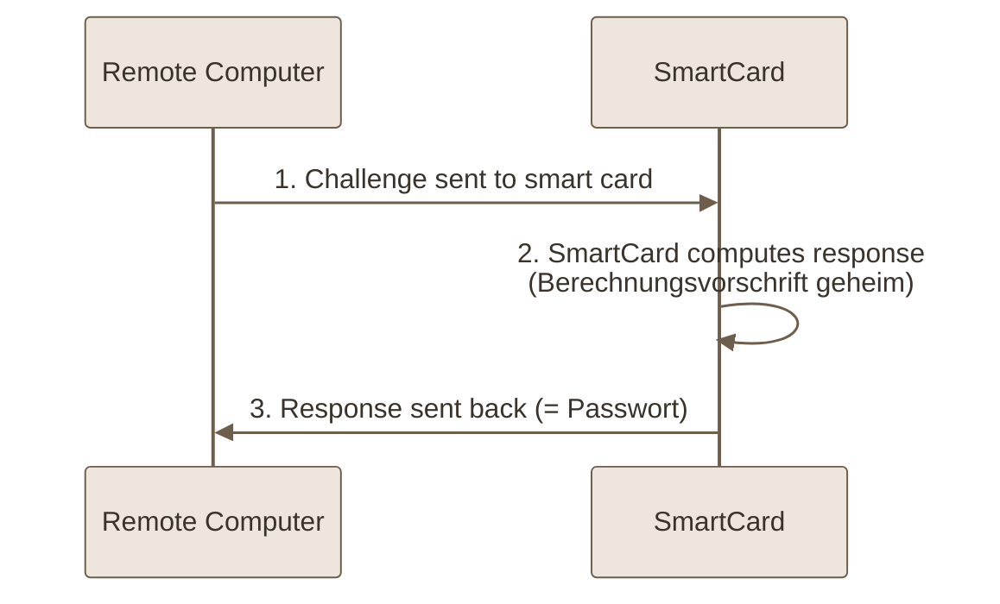
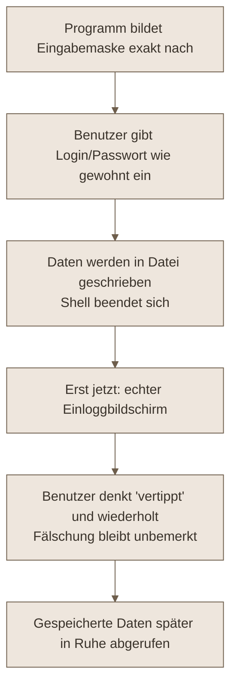
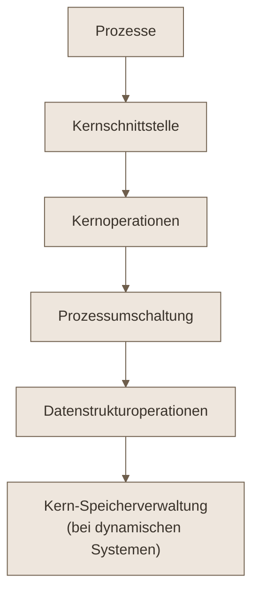
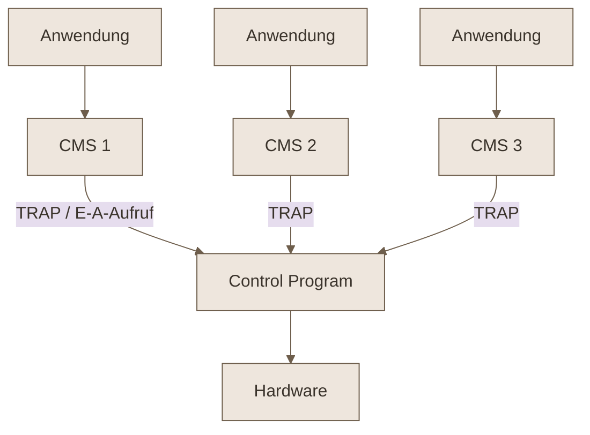
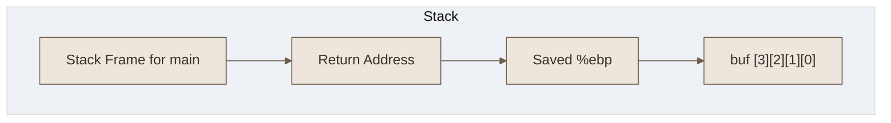

**Class:** [[SysProg - Systemprogrammierung]]  
**Date:** 05-06-2026  
**Topics:** #Betriebssysteme #Sicherheit #Architektur #Kryptografie #Authentifizierung #BufferOverflow #Mikrokern #Parallelitaet
**Link:** [[VL.08 SysProg.pdf]]

***

## 🎯 Lernziele der Vorlesung

Diese Vorlesung behandelt die **Sicherheit** von Betriebssystemen (Schutzziele, Angriffe, Schutzmechanismen) sowie deren **Architektur** (Kernstrukturen, Designprinzipien, Fallstudien und parallele Systeme).

- **Schutzziele & Bedrohungen**: Vertraulichkeit, Integrität, Verfügbarkeit, Datenschutz
- **Authentifizierung**: Wissen, Besitz, biometrische Merkmale
- **Angriffe**: Trojaner, Login-Spoofing, logische Bomben, Buffer Overflows
- **Schutzmechanismen**: Domänenkonzept, ACL vs. Capabilities, Sicherheitsklassen (TCSEC)
- **BS-Strukturen**: Monolith, Mikrokern, Hypervisor, geschichtete Systeme
- **Fallstudien**: Windows, UNIX, Android
- **Parallele Architekturen**: Flynn-Klassifikation, UMA/verteilter Speicher, Speedup & Effizienz

***

## 1. Grundlagen der Sicherheit (8.1)

### Schutzziele eines Betriebssystems

Aus Sicherheitsperspektive muss ein BS folgende Eigenschaften gewährleisten:

$$\boxed{\text{Vertraulichkeit} \;+\; \text{Integrität} \;+\; \text{Verfügbarkeit} \;+\; \text{Datenschutz}}$$

| Schutzziel | Bedeutung | Korrespondierende Bedrohung |
| ---------------------- | --------------------------------------------------------- | ------------------------------------ |
| **Datenvertraulichkeit** | Geheime Daten müssen geheim bleiben | Aufdeckung |
| **Datenintegrität** | Unautorisierte dürfen Daten nicht ändern/löschen/austauschen | Manipulation |
| **Systemverfügbarkeit** | Mindestverfügbarkeit unabhängig von der Lastsituation | Denial-of-Service (DoS) |
| **Datenschutz** | Schutz vor Missbrauch personenspezifischer Daten | Speicherung & Kombination pers. Daten |

> [!warning] **Außerdem: Datenverlust durch Betriebsstörungen** (höhere Gewalt wie Feuer), HW-/SW-Fehler oder Fehlbedienung. → Gegenmaßnahmen: **Aufbau von Redundanz** und **Backupstrategien**.

***

### Eindringlinge (Kategorien)

Unterschiedliche Kategorien greifen ein oder mehrere Schutzziele gezielt an:

- [c] **Viren**: Richten in der Regel **wahllos** Schaden an
- [c] **Herumschnuffeln**: Lesen fremder Daten aus Neugier oder für persönlichen Vorteil
	- **Nicht technisch-versierte Benutzer**: Ausnutzen bekannter Lücken, Missbrauch eigener Rechte
	- **Technisch-versierte Benutzer**: gezielte Angriffe mit großem Know-how & Zeit, oft **Ransomware**
- [c] **Wirtschaftlicher Nutzen**: z. B. Einbruch bei Bitcoin-Börsen
- [c] **Militärische / Wirtschaftsspionage**: Einbruch in Firmenrechner, um Programme, Geschäftsgeheimnisse, patentwürdige Ideen zu stehlen → Einsatz mit vielen Mitteln und ernstzunehmenden Spezialisten

***

### Kryptografie

> [!abstract] **Ziel:** 
> Eine Nachricht wird verschlüsselt und in **Chiffretext** überführt, sodass nur autorisierte Personen den **Klartext** zurückgewinnen können.

**Schlüssel:**
- $K_E$ = **Encryption Key** (Verschlüsselung)
- $K_D$ = **Decryption Key** (Entschlüsselung)

#### Grundlegende Arten

1. **Symmetrische Kryptografie (Secret-Key)**: Der Verschlüsselungsschlüssel lässt sich aus dem Entschlüsselungsschlüssel bestimmen **und umgekehrt**.
2. **Public-Key-Kryptografie**: Schlüsselpaar (Private Key $K_D$, Public Key $K_E$) mit der Eigenschaft:

$$\boxed{K_D\bigl(K_E(m)\bigr) = K_E\bigl(K_D(m)\bigr) = m}$$

| Schlüssel | Sichtbarkeit | Verwendung |
| ------------- | -------------------------------------- | ----------------- |
| **Public Key** $K_E$ | veröffentlicht (Webseite, Keyserver, Mail) | jeder kann senden |
| **Private Key** $K_D$ | bleibt geheim beim Benutzer | nur Besitzer |

***

### Einwegfunktionen und digitale Signaturen

> [!info] **Einwegfunktion** $f$: Wird $x$ verschlüsselt, so ist die Bestimmung von $x$ aus $f(x)$ **praktisch unmöglich**.

$$\boxed{x \xrightarrow{\;f\;} f(x), \quad f(x) \not\xrightarrow{\;\;\;} x \text{ (praktisch unmöglich)}}$$

**Anwendungen:** Verschlüsselung von Passwörtern; Challenge/Response auf Chipkarten (Berechnungsvorschrift $f$ geheim).

#### Digitale Signaturen (eindeutige Senderidentifikation)

Verwenden eine **Einweg-Hash-Funktion** → Ausgabe **fester Länge**:

| Hash-Funktion | Bedeutung | Ergebnislänge |
| ------------- | --------------------- | ------------- |
| **MD5** | Message Digest | 16 Byte |
| **SHA** | Secure Hash Algorithm | 20 Byte |

**Ablauf:**
1. Signierung des Hash-Wertes (evtl. Verschlüsselung der gesamten Nachricht)
2. **Bei Ankunft:**
	- Text entschlüsseln und Hash-Wert berechnen
	- Signatur entschlüsseln und beide Hash-Werte vergleichen

> [!failure] Stimmen die Werte **nicht** überein → Text, Signatur oder beides wurden **manipuliert**.

***

## 2. Benutzer-Authentifizierung (8.2)

> [!abstract] **Authentifizierung** = Feststellung der Benutzeridentität beim Einloggen.

### Die drei Faktoren

$$\boxed{\text{Wissen} \;\vee\; \text{Besitz} \;\vee\; \text{Sein}}$$

| Faktor | Realisierung durch etwas, das der Benutzer… | Beispiel |
| --------- | ------------------------------------------- | -------------------- |
| **Wissen** | weiß | Passwortabfrage |
| **Besitz** | besitzt | Chipkarte |
| **Sein** | ist | biometrische Abfrage |

***

### Authentifizierung durch Passwörter

- Einfachste Implementierung: **zentrale Liste** mit Loginname + Passwort
- Vergleich der eingegebenen mit den gespeicherten Daten → bei Übereinstimmung Zugriff
- **Angriff:** Ausprobieren von Kombinationen (Login, Passwort), unterstützt durch Wörterbücher und Namenslisten

> [!warning] Untersuchungen zeigen: **über 80 % aller Passwörter sind unsicher.**

#### Passwortsicherheit in UNIX

- Passwort dient als **Schlüssel zur Verschlüsselung eines festen Datenblocks**
- **Passwortdatei**: pro Benutzer eine Zeile mit Attributen + verschlüsseltem Passwort
- Beim Einloggen: Verschlüsselung **sofort** nach Eingabe → Vergleich der verschlüsselten Sequenzen

> [!success] Niemand (auch nicht der Sysadmin) kann die Passwörter im **Klartext** sehen.

> [!failure] **Aber:** Der Verschlüsselungsalgorithmus ist bekannt → ein Wörterbuch kann verschlüsselt und mit den Einträgen der Passwortdatei verglichen werden.

***

### Verbesserung der Passwortsicherheit

**Verzögerungsstrategien:**
- **Salt-Technik**: Erweiterung des Passworts um eine $n$-Bit lange Zufallszahl vor der Verschlüsselung (UNIX: $n=12$).

$$\boxed{\text{Größe der Test-Datei} \;\times\; 2^{n}}$$

- Verschlüsselung der **kompletten** Passwortdatei → spezielle Funktion liefert Einträge auf Anfrage (verlangsamter Zugriff)

**Weitere Maßnahmen:**
- [k] **Schwer zu erratende Passwörter**: mind. 12 Zeichen, nicht im Wörterbuch, Klein-/Großschreibung
- [k] **Erzwingen regelmäßiger Änderungen**
- [k] **Einmal-Passwörter**: Passwortliste zur sequentiellen Bearbeitung
- [k] **Challenge-Response-Verfahren**:
	- Abfrage vorher hinterlegter, verschlüsselt gespeicherter Fragen (z. B. „Name der Klassenlehrerin in der 8. Klasse?")
	- Vereinbarter Algorithmus wird mit einem vom Server gesendeten Wert ausgeführt → Ergebnis = Passwort

***

### Authentifizierung durch Gegenstände

- **Etwas haben**: Schlüssel → Türschlösser
- **Etwas haben + wissen**: Karte + PIN

| Kartentyp | Eigenschaft | Risiko / Vorteil |
| ----------------------- | ------------------------------------------------ | ----------------------------------------- |
| **Magnetstreifenkarte** | 140 Byte, oft verschlüsseltes Passwort darauf | **riskant** (Lese-/Schreibgeräte verbreitet) |
| **SmartCard** | kleine **CPU** vorhanden | Berechnungsvorschrift bleibt geheim |

**SmartCard-Ablauf (Challenge-Response):**


***

### Biometrische Authentifizierung

> [!abstract] Messung (**Registrierung**) und Vergleich (**Identifizierung**) charakteristischer, schwer zu fälschender Merkmale. Speicherung auf zentralem Rechner / SmartCard.

**Entscheidend: Güte der Merkmale**
- [p] Weite Streuung (Haarfarbe ist **kein** gutes Merkmal)
- [p] Keine gravierende Änderung im Laufe der Zeit
- [p] Erkennung von Veränderungen (Sonnenbräune, Makeup, Erkältung)

| Merkmal | Problem |
| ------------------------------- | --------------------------- |
| Fingerlänge, Fingerabdrücke | Gipsvorlagen |
| Scan der Netzhaut | Abfotografieren |
| Automatische Unterschriftenanalyse | bekannte Probleme |
| Stimmbiometrie | Täuschung durch Stimmaufnahmen |

> [!info] **Kombination** verschiedener Merkmale → erhöht die Sicherheit, **reduziert aber die Akzeptanz**.

***

## 3. Angriffe von innerhalb des Systems (8.3)

### Schadenausmaß bei geknacktem Passwort

| Systemtyp | Folge |
| -------------------- | ---------------------------------------------------------------- |
| **Eher sichere Systeme** | Nur der betroffene Benutzer erleidet Schaden |
| **Eher unsichere Systeme** | Erster Zugang = Startpunkt für wesentlich größeren Schaden |

***

### Trojanische Pferde

> [!danger] Scheinbar harmloses Programm, dessen Code aber **unerwartete und unerwünschte** Funktionalität ausführt.

**Vorgehensweise:**
1. **Tarnen** des Programms (Spiele, Apps) → Benutzer installieren es freiwillig
2. Einmal gestartet, kann das Programm **alles tun, wozu der aktuelle Benutzer berechtigt ist** (Daten übers Netz senden, Dateien modifizieren, teure Nummern anrufen)

***

### Login-Spoofing / Phishing

Dient dem **Ausspionieren von Passwörtern** während der Einloggprozedur:



> [!tip] **Schutzmöglichkeit: SCHLAU sein**
> Technisch: Start der Einloggprozedur mit einer Tastenkombination, die ein Benutzerprogramm **nicht abfangen** kann.
> **Beispiel Windows:** `STRG+ALT+ENTF` loggt den aktuellen Benutzer aus und startet die Loginprozedur – Umgehung ist nicht möglich.

***

### Logische Bomben und versteckte Hintertüren

| Konzept | Beschreibung |
| ------------------------- | ------------------------------------------------------------------------------------------------ |
| **Logische Bombe** | Vom Programmierer eingebrachter Code, der Schaden anrichten kann; oft zur **Erpressung** des Arbeitgebers |
| **Versteckte Hintertür** | Veränderte Einloggprozedur: bestimmter Loginname erlaubt Login auf **allen** ausgelieferten Systemen |

> [!example] **Logische Bombe – Mechanismus:** Solange das Passwort des Entwicklers täglich kommt oder sein Name auf der Gehaltsliste steht, passiert nichts. **Bei Entlassung** wird der Code aktiviert und richtet Schaden an.

> [!info] **Hintertür** umgeht den **gesamten** Authentifizierungsprozess.

> [!success] **Vermeidung durch Code Reviews:** Entwickler erklärt seinen Code Zeile für Zeile; die übrigen Teammitglieder überprüfen den Code (→ Software Engineering).

***

### Pufferüberläufe (Buffer Overflows)

> [!danger] **Umlenkung der Rücksprungadresse** auf ein eingeschleustes Programm.

**Mechanismus:**
- Bei Funktionsaufrufen werden **Rücksprungadresse und Parameter auf den Stapel** gelegt
- Für Parameter (z. B. Dateiname) wird Speicher gemäß String-Definition reserviert
- Wird diese Grenze durch einen **extralangen Namen** überschritten, wird die **Rücksprungadresse überschrieben**:

| Folge | Auswirkung |
| ----------------------------------- | ---------------------- |
| Sprung in fremden/gesperrten Adressraum | **Absturz** |
| Pufferinhalt = ausführbares Programm | **Großer Schaden** |

#### Wo & Wie?

- **Wo:** überall, wo Felder fester Größe für Benutzereingaben genutzt werden (Dateinamen, Umgebungsvariablen, Datenabfragen)
- **Wie finden:**
	- **Extremeingaben** bei allen Aufforderungen → Absturz deutet auf Pufferüberlauf
	- Analyse des Fehlerreports (z. B. `core`-Datei) → Rückschlüsse auf Stackaufbau
	- Bei **offenen Quellen** einfacher (in beiden Richtungen: Ausnutzen & Verhindern)

> [!success] **Verhinderung:**
> - Routinen mit Längenlimit: `fgets` statt `gets`, `strncpy` statt `strcpy`
> - **Memory-safe Sprachen**: Rust (auch Go, Java, C#, Swift, Python)

***

### Angriffe von außerhalb des Systems

Vernetzung → vielfältige Angriffsmöglichkeiten. Häufige Angriffe:

| # | Angriff | Beschreibung |
| --- | ------------------------- | ----------------------------------------------------------- |
| 1 | **Phishing** | Täuschende Mails/Webseiten zum Abgreifen sensibler Daten |
| 2 | **Ransomware** | Verschlüsselt Dateien, fordert Lösegeld zur Freigabe |
| 3 | **Denial-of-Service (DoS)** | Überlastung eines Systems/Netzwerks |
| 4 | **Man-in-the-Middle (MitM)** | Abfangen/Manipulieren der Kommunikation zwischen zwei Parteien |
| 5 | **SQL Injection** | Ausnutzen von Schwachstellen in DB-Abfragen |
| 6 | **Cross-Site Scripting (XSS)** | Einschleusen bösartiger Skripte in Webseiten anderer Nutzer |
| 7 | **Zero-Day Exploits** | Angriffe auf unbekannte Lücken, bevor Entwickler reagieren können |
| 8 | **DNS Spoofing** | Umleitung von DNS-Anfragen auf bösartige Seiten |

> [!note] Netzwerksicherheit ist ein sehr umfangreiches Thema → eigene Vorlesungen in Bachelor/Master (Grundlagen der Netzwerke fehlen aktuell noch).

***

## 4. Schutzmechanismen (8.4)

### Domänenkonzept (domain)

> [!abstract] Grundlage für Sicherheit. Eine **Domäne** = **Menge von Paaren (Objekt, Rechte)**.

$$\boxed{\text{Domäne} = \{(\text{Objekt}_1, \text{Rechte}_1), (\text{Objekt}_2, \text{Rechte}_2), \dots\}}$$

- Jedes Paar spezifiziert ein eindeutig identifiziertes **Objekt** (HW, Prozess, Datei, Semaphore) und die **Rechte** für ausführbare Operationen
- Eine Domäne kann einem Benutzer entsprechen oder allgemeiner Natur sein
- Ein Prozess läuft zu jedem Zeitpunkt in **genau einer** Schutzdomäne; Domänenwechsel ist möglich (systemabhängig)

#### Domänenkonzept in UNIX

- Domäne eines Prozesses wird durch **BenutzerID (UID)** und **GruppenID (GID)** festgelegt
- Für jede Kombination $(\text{UID}, \text{GID})$ → Liste aller benutzbaren Objekte
- Prozessaufteilung in **Benutzer- und Kernteil** (unterschiedliche Domänen)
- `sudo` (superuser do) → temporäre Anhebung der Privilegien

***

### Realisierung des Domänenkonzepts: Schutzmatrix

- Modellierung als **Matrix**: ein Objekt pro Spalte, eine Domäne pro Zeile
- Zellen enthalten – falls vorhanden – die zulässigen Operationen
- **Domänen sind selbst Objekte** → Modellierung des Übergangs (z. B. `Enter`)

> [!warning] **Matrixdarstellung ineffizient** (zu viele leere Felder) → Speicherung **nur der Spalten** (ACL) oder **nur der Zeilen** (Capabilities).

| Speicherform | Speichert | Sicht |
| ------------ | ----------- | ------------------ |
| **ACL** | Spalten | pro **Objekt** |
| **Capabilities** | Zeilen | pro **Subjekt** |

***

### Zugriffskontrolllisten (ACL) vs. Capabilities

#### Access Control Lists (ACL)

> Eine **Liste pro Objekt** spezifiziert, welches Subjekt (Prozess, Benutzer) welche Operation ausführen darf.

- **UNIX**: Unterscheidung Eigentümer / Gruppe / restliche Benutzer
- **Windows**: beliebig viele Einträge → feiner spezifizierte Kontrolle
- Beim Zugriff: Prüfung, ob $(\text{UID}, \text{GID})$ in der ACL des Objekts enthalten ist

**Beispiel (R=Read, W=Write, X=eXecute):**

| Datei | ACL |
| ----- | ------------------ |
| F1 | A:RW; B:R |
| F2 | A:R; B:RW; C:R |
| F3 | B:RWX; C:RX |

#### Capabilities (C-Listen)

> Spezifizieren die Berechtigung eines **Subjekts**, auf ein bestimmtes Objekt zuzugreifen.

$$\boxed{\text{Capability} = \text{Objektbezeichner} + \text{Bitmap für Zugriffsrechte}}$$

- Jedem Subjekt wird seine eigene Domäne **angehängt**; Verwaltung in einer Liste (Referenz auf Objekt + Menge der Operationen)

**Schutz der C-Listen:**
- [b] **Tagged Architecture**: spezielles Bit zeigt an, ob ein Speicherwort eine Capability enthält → Änderung nur im **Kernmodus**
- [b] C-Listen **innerhalb des BS-Kerns** gehalten, über Position referenziert
- [b] **Verschlüsselte** C-Listen im Benutzermodus → Manipulation schwer

***

### Beispiel: tubCloud Links (Capability-Prinzip)

- Besitzer/Ersteller eines Objekts vergibt die Rechte
- Subjekt mit Zugriffsrechten kann diese **weiterreichen** (z. B. Sharing-Links)

> [!example] **Google-Docs Link als Capability:**
> - Dokument-ID = **44 Zeichen**, uniform und nicht vorhersehbar
> - Zeichensatz: Uppercase + lowercase + digits + underscore = **63 mögliche Zeichen**

$$\boxed{63^{44} \approx 2^{263} \;\text{Kombinationen} \rightarrow \text{nicht in realistischer Zeit ausrechenbar}}$$

> Die tatsächlichen Rechte (R/W/X) sind auf dem Server gespeichert (Owner, Link-Owner).

***

### Absicherung nach NIST

> [!info] Standardkonfigurationen orientieren sich oft an **Benutzerfreundlichkeit/Funktionalität**, nicht an Sicherheit. Organisationen haben eigene, unterschiedlich strenge Sicherheitspolicies.

**Basisschritte (NIST):**
- [ ] BS installieren, konfigurieren, **patchen**
- [ ] Benutzer, Gruppen und Berechtigungen konfigurieren
- [ ] Ressourcenkontrollen konfigurieren
- [ ] Zusätzliche Sicherheitskontrollen installieren (Virenschutz, **Honeypots**, Host-Firewalls, **Intrusion Detection**)
- [ ] Unnötige Dienste, Anwendungen, Protokolle entfernen
- [ ] Testen

→ Grundprinzip: **explizite Freigabe** von Nutzern, Ressourcen, Anwendungen und Verbindungen.

***

### Sicherheitsanforderungen: TCSEC (Orange Book, 1983)

> [!abstract] **Trusted Computer System Evaluation Criteria** – Sicherheitsbewertung von Rechnersystemen durch das US-Verteidigungsministerium.

| Klasse | Bedeutung |
| ------ | -------------------------------------------------- |
| **D** | Minimaler Schutz (niedrigste Klasse) |
| **C1** | Sicherheitsschutz nach Ermessen |
| **C2** | Kontrollierter Zugriffsschutz ⟵ **aktuell Linux, Windows** |
| **B1** | Sicherheitsschutz mit Etiketten |
| **B2** | Strukturierter Schutz |
| **B3** | Sicherheitsdomänen |
| **A1** | Verifizierter Entwurf (höchste Klasse) |

> [!key] Merkhilfe: Reihenfolge **D → C → B → A** (steigende Sicherheit), Zahlen innerhalb der Klasse ebenfalls steigend.

#### C2-Standard Umsetzung

- **Sicheres Anmelden** mit Antispoofing: `STRG-ALT-ENTF` wird immer vom Tastaturtreiber erkannt → Systemprogramm mit originalem Anmeldebildschirm
- **Frei einstellbare Zugriffskontrollen**: Besitzer vergibt Rechte (verschiedene Gruppen, verschiedene Rechte)
- **Privilegierte Zugriffskontrollen**: Administrator kann Dateirechte überschreiben
- **Adressraumschutz**: jeder Prozess hat eigenen, abgeschotteten Adressraum
- **Stackseiten** müssen vor Einlagerung mit **Nullwerten** belegt werden (keine Info über vorherigen Besitzer)
- **Security Auditing**: Log über sicherheitsrelevante Ereignisse

***

### Vertrauenswürdige Systeme (Trusted Computing Base)

**Gründe für die Existenz nicht-sicherer Systeme:**
- [c] **Bequemlichkeit**: geringe Bereitschaft, gefährliche Features aufzugeben (z. B. Word-Attachments statt ASCII-Mails, Öffnen mit einem Klick)
- [c] **Komplexität**: neue Features bergen Fehler → das Sicherheitssystem im BS-Kern sollte **einfach genug** sein, um vollständig verstanden zu werden

> [!abstract] **Trusted Computing Base (TCB)** statt „sicheres System": minimale HW und SW, die einer Sicherheitsspezifikation folgt, diese vollständig umsetzt und nicht kompromittiert werden kann.

**Bestandteile der TCB:** HW, Betriebssystemkern, alle Programme mit **Superuserrechten**.

***

## 5. Strukturen der Betriebssysteme (8.5)

### Der Kern eines Betriebssystems

Schichtung der Kernoperationen (von unten nach oben), getrennt von Prozessen durch die **Kernschnittstelle**:



***

### Designprinzipien (nicht nur für BS)

> [!quote] **KISS**: *keep it small and simple; keep it simple, stupid.*

- [I] **C.A.R. Hoare (1934–):** Es gibt zwei Wege, Software zu bauen – einer ist, sie so einfach zu machen, dass es offensichtlich keine Mängel gibt; der andere, sie so kompliziert zu machen, dass keine offensichtlichen Mängel existieren. **Der erste Weg ist weitaus schwerer.**
- [I] **A. Einstein (1879–1955):** Alles sollte so einfach wie möglich gemacht werden, **aber nicht einfacher**.
- [I] **A. de Saint-Exupéry (1900–1944):** Perfektion ist erreicht, wenn man nichts mehr **weglassen** kann (nicht, wenn man nichts mehr hinzufügen kann).

***

### Modularisierung und Hierarchien

Zerlegung in Module derart, dass:
- [p] **Hohe** Interaktion (Info-/Kontrollflüsse) **innerhalb** des Moduls
- [p] **Geringe** Interaktion **zwischen** den Modulen
- [p] **Einfache** Schnittstellen zwischen Modulen
- [p] Module sind durch begrenzte Größe/Komplexität **leicht verständlich**

> [!info] Hierarchische Ansätze (z. B. **Bäume**) → erhöhen Skalierbarkeit, reduzieren Komplexität.

***

### Zerlegung in Schichten

- Einfache, universelle Funktionen **unten**, komplexere/spezifischere Funktionen **oben**
- Jede Schicht ist eine **Abstraktion** der niedrigeren Schichten
- Jede Schicht bietet eine **Schnittstelle** für die höheren Schichten
- **Anwendungsneutral**: spezifische Anforderungen möglichst in der obersten Schicht

> [!example] **Standard bei Netzwerken** (OSI-Modell): Physical → Data Link → Network → Transport → Session → Presentation → Application.

***

### Sanduhr-Architektur

> [!abstract] Vielfalt **oben** (Anwendungen), Vielfalt **unten** (Hardware), schmale **uniforme Mitte** (BS API / Uniformity).

| Schicht | Betriebssystem | Analogie Internet |
| ------- | ------------------------- | ------------------------- |
| Oben | Vielfalt von Anwendungen | Web, Mail, Streaming, VoIP |
| **Taille** | **BS API (Uniformity)** | **Internet Protocol (IP)** |
| Unten | Vielfalt von Hardware | 5G, Kabel, DSL |

***

### Orthogonalität und SPOT

- **Orthogonalität**: Funktionen/Konzepte eines BS sollen **unabhängig** voneinander sein → orthogonale Entwurfskriterien ermöglichen **Kombinationsfreiheit**.
- **Single Point of Truth (SPOT)**: keine Kopien/Wiederholungen.

| Aspekt | SPOT-Regel |
| -------- | ------------------------------------------------------- |
| **Code** | Jede Funktionalität wird **genau einmal** implementiert |
| **Daten** | Jede Information hat **genau eine** Repräsentation |

> [!success] SPOT vermeidet **Inkonsistenzen**.

***

### Strukturen im Überblick

- Monolithisches System
- (historisch: Geschichtetes System)
- Hypervisor mit Virtuellen Maschinen
- Mikrokern
- Exokern

***

### Monolithische Systeme

> Gesamte Funktionalität in **einem großen Programm** vereint: Unterbrechungs- & Systemaufrufbehandlung, E/A-Treiber, Scheduler, Dateisysteme, Netzwerkprotokolle.

| Vorteile | Nachteile |
| ----------------------- | ------------------------------------------------------------ |
| [S] Einfach zu konstruieren | [c] Menge an Quellcode sehr groß |
| | [c] Keine Trennung zwischen Komponenten → anfällig für Sicherheitsprobleme/Abstürze |
| | [c] Der **gesamte** Kern muss vertrauenswürdig sein |
| | [c] Problem mit Treibern von Drittherstellern |

> [!warning] Leider **am häufigsten** vertreten → „historisch gewachsene" Systeme.

#### Monolithische Systeme mit Modulen

- Problem: Linux enthält Treiber für **Tausende** Geräte, ein PC hat nur ein paar Dutzend → Kern unnötig groß
- **Idee:** Treiber separat kompilieren & **bei Bedarf laden**, wenn das BS ein Gerät vorfindet (übertragbar auf Dateisysteme, Netzwerkprotokolle)

> [!failure] **Aber:** löst **nicht** das Sicherheitsproblem!

***

### Geschichtete Systeme (historisch)

- Vgl. **„THE Multiprogramming System"** von E. Dijkstra
- Monolithisches Design, aber mit **interner Struktur**
- Abhängigkeit nur von **höherer zu niederer** Schicht
- Soll Entwicklung und formale Beschreibung vereinfachen

| Schicht | Funktion |
| ------- | ------------ |
| 5 | Nutzer |
| 4 | Programme |
| 3 | Geräte E/A |
| 2 | Konsole E/A |
| 1 | Speicherverw. |
| 0 | Scheduler |

***

### Mikrokern

> [!abstract] Idee eines **minimalen Kerns**: Auslagerung von BS-Funktionen als normale Prozesse im **Benutzerraum** (nicht im privilegierten Raum).

- Server-Dienste: Dateiserver, Grafikanzeigeserver, Druckserver
- **Paradigma:** nur Funktionalität, die den Systemmodus **unbedingt** benötigt, verbleibt im Kern

#### Mikrokern-Architektur

- Historisch: Abgrenzung zu UNIX, bei dem die gesamte Ressourcenverwaltung (z. B. Dateisystem) im Kern (**Makrokern**) liegt

| Kern | Größe |
| ----------------- | ----------------- |
| **Mach** (OSF-1) | mehrere MByte |
| **Cozy** | 100 KB |

> Solche Abweichungen führen zu Namen wie **Nanokernel** oder **Picokernel**. Keine allgemeine Einigung über Kernfunktionen, aber **Prozessmanagement** und **Prozesskommunikation** sind unerlässlich.

#### Vor- und Nachteile

| Vorteile | Nachteile |
| ------------------------------------------------------- | ------------------------------- |
| [p] Schlanker, effizienter Kern | [c] Komplexe Implementierung |
| [p] **Fehlerbegrenzung**: abgestürzter Dienst neustartbar | [c] **Langsamere Systemaufrufe** (Prozessumschaltung) |
| [p] Sicherheit & Stabilität (Kern unbeeinflusst von Diensten) | |
| [p] Sicherheitskritischer Teil kleiner & leichter zu **verifizieren** | |
| [p] Flexibilität: Dienste im laufenden Betrieb hinzufügbar/entfernbar | |

***

### Hypervisor und Virtuelle Maschinen

- **IBM CP/CMS** = erster Hypervisor (später re-implementiert als **VM/370**)

| Komponente | Aufgabe |
| ---------------------------- | ------------------------------------------------------------------ |
| **Control Program (CP)** | Läuft auf realer HW, bildet die echte Systemhardware nach |
| **Cambridge Monitor System (CMS)** | Häufig genutztes (Single-User-) BS in den von CP bereitgestellten VMs |

> Systemaufrufe der Anwendungen landen in CMS; E/A-Zugriffe von CMS werden durch CP überwacht (über **TRAP**).



***

## 6. Fallstudien (8.6)

### Fallstudie: Windows

- Ursprünglich für **mehrere Teilsysteme** ausgelegt (Unix, OS/2, Windows)
- Kern oft als **Mikrokern** bezeichnet, enthält aber Komponenten, die nach Mikrokerndefinition nicht zwingend integriert sein müssen
- **Schichten:** Hardwareabstraktionsschicht (**HAL**) → Kern (zentrale Aufgaben) → **Executive** → Gerätetreiber

> [!example] **Windows Architektur** – Trennung in **user mode** (csrss, session manager, SCM, services, applications, ntdll.dll, subsystem dlls) und **kernel mode** (I/O manager, executive mit object/security reference/process/memory manager etc., kernel, HAL, Hyper-V hypervisor, hardware).

***

### Fallstudie: Unix

- **Schichten-basiertes** System mit **monolithischem Kern**
- **Kernmodus:** alle Befehle mit HW-Zugriff; kritische Dienste (Scheduler, Module-Loader, Prozessmanagement, Semaphore, Tabelle der Systemaufrufe)
- Beispielstruktur: **4.4BSD-Kern** (Systemaufrufe & Unterbrechungen oben; Terminalbehandlung, Sockets, Dateisysteme, virtueller Speicher, Signalbehandlung; darunter Gerätetreiber; ganz unten Hardware)

***

### Fallstudie: Android

> Betriebssystem **und Middleware** für mobile Geräte; entwickelt von der **Open Handset Alliance**.

- Basis: **Linux-Kernel 2.6**
- **Freie und quelloffene** Software; **SDK** zur App-Entwicklung in **Java**

**Historie:**
- [n] 2003: Android = Unternehmen für standortbezogene Dienste, gegründet
- [n] Sommer 2005: **Aufkauf durch Google**
- [n] Ende 2007: Gründung der **Open Handset Alliance**

#### Android-Schichten (von unten nach oben)

| Schicht | Aufgabe |
| --------------------------- | ----------------------------------------------------------------------- |
| **Linux-Kernel** | Grundlage; Treiber (Anzeige, Kamera, Bluetooth, Audio, Speicher); Abstraktion HW ↔ Komponenten |
| **Hardware Abstraction Layer (HAL)** | Bibliotheken mit Schnittstellen für HW-Komponenten (z. B. Kamera) |
| **Native C/C++-Bibliotheken** / **Android Runtime (ART)** | ART stützt sich auf Linux-Kernel (Threading, Low-Level-Speicherverwaltung) |
| **Java API-Framework** | Zugang zum BS-Funktionsumfang (GUI, Ressourcen, Benachrichtigungen, Aktivitätsmanager, **Content Provider**) |
| **System-Apps** | Kern-Apps: E-Mail, SMS, Kalender, Internet, Kontakte |

**Funktionen des Linux-Kernels:** Sicherheit, Speicherverwaltung, Prozessmanagement (Ressourcenzuweisung), Netzwerkkommunikation, Treibermodell.

***

## 7. Betriebssysteme für parallele Architekturen

> Unterstützung für die **gleichzeitige Ausführung** von Befehlen.

| Art des Parallelismus | Beschreibung |
| --------------------- | ------------------------------------------------------------------------------------- |
| **Implizit** | Parallelität **nicht a priori** bekannt → Datenabhängigkeitsanalyse zur **Laufzeit** |
| **Explizit** | Parallelität **a priori festgelegt** → geeignete Datentypen/-strukturen (z. B. Vektoren) bei Programmerstellung |

***

### Klassifikation nach Flynn

> [!abstract] Unterscheidung nach Anzahl der **Befehls-** und **Datenströme**.

| | **SD** (Single Data) | **MD** (Multiple Data) |
| ------------------------ | ----------------------------- | ---------------------------------------------- |
| **SI** (Single Instruction) | **SISD** – konventionelle von-Neumann-Rechner | **SIMD** – Vektorrechner, Feldrechner |
| **MI** (Multiple Instruction) | **MISD** – Datenflussmaschinen | **MIMD** – Multiprozessoren, Parallelrechner, verteilte Systeme |

***

### Architekturen mit gemeinsamem Speicher (UMA)

> **Uniform Memory Access (UMA):** Zugriffsweise für jede Kombination (CPU, Speicher) identisch → **gleichförmige Latenz**.

**Beispiel: Symmetrische Multiprozessoren (SMP)** (z. B. aktuelle Multicore-CPUs):
- Mehrere baugleiche, gleichberechtigte Prozessoren
- Alle anderen Elemente aus BS-Sicht **einmal** vorhanden
- Physikalisch können Komponenten aus mehreren Einheiten bestehen (z. B. Festplattenarrays)

***

### Architekturen mit verteiltem Speicher

Vernetzte **Knoten** mit jeweils: einem/mehreren Prozessoren, lokalen Speichermodulen, Verbindungsschnittstellen.
- Kommunikation/Synchronisation erfolgt durch **Austausch von Nachrichten**

**Aufgaben des BS:**
- [k] Verstecken der **Komplexität** für Entwickler/Administratoren
- [k] **Zuverlässigkeit & Fehlertoleranz** (Komponentenausfälle wahrscheinlich)
- [k] **Koordination** riesiger CPU-/GPU-Zahlen → möglichst nah an die mögliche Rechenleistung

***

### Bewertung paralleler Programme

**Speedup** (Beschleunigung durch Parallelität):

$$\boxed{S_P = \frac{\text{Rechenzeit 1 CPU}}{\text{Rechenzeit } p \text{ CPUs}} = \frac{T_1}{T_p}, \qquad S_P \in (0, p]}$$

**Effizienz** (Auslastung):

$$\boxed{E_P = \frac{S_p}{p} = \frac{\text{Speedup bei } p \text{ CPUs}}{p}, \qquad E_P \in (0, 1]}$$

> [!info] **Idealfall:** $S_P = p$ und $E_P = 1$ (lineare Beschleunigung, volle Auslastung). In der Praxis liegen beide Werte darunter.

***

### Massiv-parallele Clustersysteme

> Höchstleistungsrechner für Wettervorhersage, Medikamentenentwicklung, Simulation.

**Typische Merkmale:**
- [l] Große Knotenanzahl: $O(100\,000)$ bis $O(1\,000\,000)$ (siehe top500.org)
- [l] Standard-CPUs/GPUs
- [l] Lokaler, privater Speicher + Kommunikationsprozessor
- [l] Leistungsfähiges, herstellerspezifisches Netzwerk (große Bandbreite, niedrige Latenz)
- [l] Spezielle Knoten für E/A-Kontrolle, Administration, Anmeldung, externen Zugriff
- [l] Zentrale Jobverteilung

→ Entwicklung hauptsächlich mit dem **nachrichten-basierten Programmiermodell**.

***

## 8. Zusatz: Buffer Overflow im Detail

### Warum entsteht der Fehler? — String-Library Code

> [!bug] In **C** erfolgt **keine Überprüfung der Bereichsgrenzen** (weder bei Programmerstellung noch zur Laufzeit).

**Beispiel `gets`** – keine Möglichkeit, die Anzahl zu lesender Zeichen zu spezifizieren:

```c
/* Get string from stdin */
char *gets(char *dest) {
    int c = getc();
    char *p = dest;
    while (c != EOF && c != '\n') {
        *p++ = c;
        c = getc();
    }
    *p = '\0';
    return dest;
}
```

**Ähnlich problematische Funktionen:**
- `strcpy`: kopiert einen String **beliebiger Länge**
- `scanf`, `fscanf`, `sscanf` mit `%s`-Konvertierungsspezifikation

***

### Boshafte Nutzung

> [!danger] Mit Buffer-Overflow-Bugs lässt sich **beliebiger Code** auf einer fremden Maschine ausführen.

1. Eingabe-String enthält die **binäre Codierung** des ausführbaren (Exploit-)Codes
2. **Überschreibt die Rücksprungadresse** mit der Adresse des Buffers
3. Wenn `bar()` ein `ret` ausführt → **Sprung zum Exploit-Code**

```c
void foo() {
    bar();
    ...
}
void bar() {
    char buf[64];
    gets(buf);
    ...
}
```

***

### Angreifbarer Buffer-Code (Demo)

```c
/* Echo Line */
void echo() {
    char buf[4];   /* too small! */
    gets(buf);
    puts(buf);
}
int main() {
    printf("Type a string:");
    echo();
    return 0;
}
```

| Eingabe | Verhalten |
| ------------ | ----------------- |
| `123` | OK (passt in `buf[4]` inkl. `\0`) |
| `12345` | **Segmentation Fault** |
| `12345678` | **Segmentation Fault** |

***

### Stack während des Buffer Overflows

Stackaufbau bei `echo()`: oben **Stack Frame for main** → **Return Address** → **Saved %ebp** → **buf[3..0]** → unten **Stack Frame for echo**.



| Fall | Eingabe | Wirkung |
| ------ | ----------- | --------------------------------------------------------------------------------- |
| **#1** | `123` | **Kein Problem** – Daten passen in den Buffer |
| **#2** | `12345` | Gespeicherter **%ebp** wird überschrieben (z. B. auf `0xbfff0035`) → schlechte Nachricht beim Wiederherstellen von %ebp |
| **#3** | `12345678` | **%ebp UND Rücksprungadresse** überschrieben → ungültige Adresse, zeigt nicht mehr auf die gewünschte Rücksprungadresse |

> [!key] Kernidee: Der zu kleine `buf` liegt **unterhalb** von Saved %ebp und Return Address auf dem Stack. Zu lange Eingaben „wachsen" in diese Felder hinein und überschreiben sie.

***

## 📌 Zusammenfassung

### Wichtige Konzepte

| Konzept | Bedeutung |
| ----------------------- | --------------------------------------------------------------- |
| **Schutzziele** | Vertraulichkeit, Integrität, Verfügbarkeit, Datenschutz |
| **Symmetrische Krypto** | Ein Schlüssel für Ver-/Entschlüsselung (ableitbar) |
| **Public-Key** | Schlüsselpaar; $K_D(K_E(m)) = K_E(K_D(m)) = m$ |
| **Einwegfunktion** | $f(x)$ leicht zu berechnen, $x$ aus $f(x)$ praktisch unmöglich |
| **Salt** | Zufallszahl vor Verschlüsselung → Testdatei $\times\, 2^n$ größer |
| **Domäne** | Menge von Paaren (Objekt, Rechte) |
| **ACL** | Liste **pro Objekt** (welches Subjekt darf was) |
| **Capability** | Objektbezeichner + Bitmap; Liste **pro Subjekt** |
| **TCB** | Minimale, nicht kompromittierbare HW+SW; HW, Kern, Superuser-Progr. |
| **Mikrokern** | Minimaler Kern, BS-Dienste als User-Prozesse |
| **Buffer Overflow** | Überschreiben der Rücksprungadresse durch zu lange Eingabe |

### Kernaussagen

- [p] **Public-Key**: Public Key veröffentlicht, Private Key geheim → kein vorheriger Schlüsselaustausch nötig
- [p] **UNIX-Passwörter** werden nur verschlüsselt gespeichert; niemand sieht den Klartext – aber der Algorithmus ist bekannt (Wörterbuchangriff möglich)
- [p] **`STRG+ALT+ENTF`** ist die klassische Antispoofing-Maßnahme (vom Tastaturtreiber abgefangen, nicht umgehbar)
- [p] **Mikrokern** = mehr Sicherheit/Stabilität, aber langsamer durch Prozessumschaltung
- [!] **Achtung:** Monolithische Systeme mit Modulen lösen **nicht** das Sicherheitsproblem – nur das Größenproblem
- [!] **Achtung:** $S_P \le p$ und $E_P \le 1$ — Speedup kann (im Normalfall) nicht über die CPU-Anzahl hinausgehen
- [c] **Falsch:** `gets`/`strcpy` ohne Längenbegrenzung verwenden → stattdessen `fgets`/`strncpy` oder memory-safe Sprachen

### Wichtige Formeln & Werte

| Konzept | Formel / Wert |
| ------------------- | ----------------------------------- |
| **Public-Key** | $K_D(K_E(m)) = K_E(K_D(m)) = m$ |
| **Salt-Faktor** | $\times\, 2^{n}$ (UNIX: $n=12$) |
| **Google-Doc-ID** | $63^{44} \approx 2^{263}$ Kombinationen |
| **Speedup** | $S_P = T_1 / T_p,\; S_P \in (0,p]$ |
| **Effizienz** | $E_P = S_p / p,\; E_P \in (0,1]$ |
| **MD5 / SHA** | 16 Byte / 20 Byte Hash |

***

## 🔗 Verbindungen zu anderen Vorlesungen

- [[VL.07 Dateisysteme]]: Speicherverwaltung & virtueller Speicher → Adressraumschutz, Stackaufbau bei Buffer Overflows
- [[VL.02 Betriebssyteme und Prozesse]]: Domänenkonzept, Prozesskommunikation (IPC) als Mikrokern-Kernfunktion
- [[VL.07 Dateisysteme]]: ACL & UNIX-Rechte (Eigentümer/Gruppe/andere)
- [[VL.03 Scheduling]]: Scheduler als zentraler Dienst im (Makro-)Kern
- [[Grundlagen der Netzwerke]]: Netzwerkangriffe (MitM, DNS Spoofing), OSI-Schichtenmodell