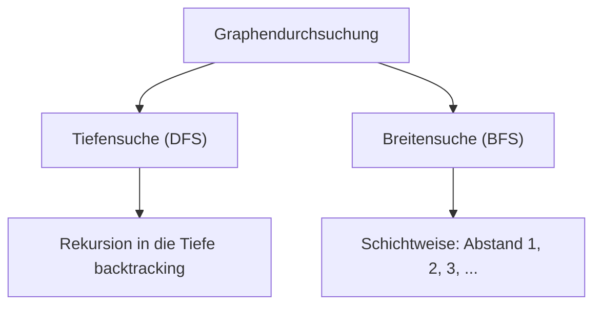

**Class:** [[AlgoDat - Algorithmen und Datenstrukturen]]
**Date:** 28-05-2024
**Topics:** #Graphen #DFS #BFS #TopologischeSortierung #Datenstrukturen
**Link:** [[VL.07 AlgoDat.pdf]]

***

## 🎯 Lernziele der Vorlesung

Diese Vorlesung behandelt **ungewichtete Graphen**: von grundlegenden Definitionen über Datenstrukturen zur Repräsentation bis hin zu Suchalgorithmen und topologischer Sortierung.

- **Grundbegriffe**: Graph, Knoten, Kante, Adjazenz, Inzidenz, Grad, Zusammenhang
- **Datenstrukturen**: Adjazenzmatrix, Adjazenzlisten, Doppelt verkettete Pfeillisten (DCAL)
- **Tiefensuche (DFS)**: Erreichbarkeit, Pfade, Zusammenhangskomponenten, Zykluserkennung
- **Breitensuche (BFS)**: Erreichbarkeit, Pfade mit minimaler Kantenanzahl
- **Kantenklassifikation** in gerichteten Graphen (Baum-, Vorwärts-, Rückwärts-, Seitenkante)
- **Topologische Sortierung**: Reverse-Postorder in DAGs

***

## 1. Grundbegriffe von Graphen

### Definition (Graph)

Ein Graph modelliert Vernetzungen, z. B. Computernetzwerke oder Straßenkarten.

$$\boxed{G = (V, E)}$$

- $V$ = endliche Menge von **Ecken / Knoten** (*vertices / nodes*)
- $E$ = Menge von **Kanten** (*edges*), wobei jede Kante zwei Knoten verbindet: $e = (v, w),\; v,w \in V$
- $V = |V|$, $E = |E|$ bezeichnen die jeweiligen **Anzahlen** (nicht-fett)
- Knoten werden als natürliche Zahlen gewählt: $V = \{0, \ldots, V-1\}$

> [!info] **Merkhilfe:** $G = (V, E)$ — *Vertices* und *Edges*. Denke an eine Landkarte: Städte = Knoten, Straßen = Kanten.

### Adjazenz & Inzidenz

- $v$ und $w$ heißen **adjazent** (*adjacent*), wenn eine Kante $(v,w) \in E$ existiert
- Knoten $v$ heißt **inzident** (*incident*) mit Kante $e$, wenn $v$ Endpunkt von $e$ ist

### Gerichtete vs. ungerichtete Graphen

| Eigenschaft | Ungerichteter Graph | Gerichteter Graph (Digraph) |
|---|---|---|
| Kantensymmetrie | $(v,w) \equiv (w,v)$ | $(v,w) \neq (w,v)$ |
| Kantenbezeichnung | Kante | Pfeil / Arc: $v \to w$ |
| Anfangs-/Endknoten | – | head = $v$, tail = $w$ |
| Schlingen erlaubt | Ja $(v,v)$ | Ja $(v,v)$ |

### Teilgraph

$$\boxed{G' = (V', E') \text{ ist Teilgraph von } G = (V,E) \iff V' \subseteq V \text{ und } E' \subseteq E}$$

### Pfade und Zyklen

| Begriff | Definition |
|---|---|
| **Pfad / Weg** | Folge von Knoten, verbunden durch Kanten |
| **Einfacher Pfad** | Jeder Knoten kommt nur einmal vor |
| **Zyklus** | Pfad, bei dem Anfangs- und Endknoten übereinstimmen |
| **Einfacher Zyklus** | Alle Knoten nur einmal, außer Anfang = Ende |
| **Azyklisch** | Graph ohne Zyklen |
| **Länge** | Anzahl der Kanten im Pfad |

Formale Definition eines Pfades von $s$ nach $t$:

$$\boxed{v_0, v_1, \ldots, v_K \;\text{ mit }\; s = v_0,\; t = v_K,\; (v_k, v_{k+1}) \in E \;\forall k < K}$$

### Weitere Begriffe

- **Ordnung** eines Graphen: Anzahl seiner Knoten $|V|$
- **Grad** eines Knotens: Anzahl inzidenter Kanten
- Bei Digraphen: **Eingangsgrad** (ankommende Pfeile) und **Ausgangsgrad** (ausgehende Pfeile)
- **Quelle**: Eingangsgrad = 0, Ausgangsgrad > 0
- **Senke**: Ausgangsgrad = 0, Eingangsgrad > 0
- **Parallele Kanten / Mehrfachkanten**: zwei Kanten verbinden dieselben zwei Knoten

### Zusammenhang

$$\boxed{G \text{ zusammenhängend} \iff \forall\, v, w \in V \;\exists \text{ Weg von } v \text{ nach } w}$$

- **Zusammenhangskomponenten** (*connected components*): Teile eines nicht-zusammenhängenden Graphen
- **Stark verbunden** (Digraph): Es gibt Pfade in *beiden* Richtungen zwischen $s$ und $t$
- **Stark zusammenhängend**: alle Knoten des Digraphen sind stark verbunden
- Starkes Verbundensein ist eine **Äquivalenzrelation** → starke Zusammenhangskomponenten

### Bäume und Wälder

$$\boxed{\text{Baum} = \text{azyklischer, zusammenhängender Graph}}$$

- **Wald**: Menge von Bäumen ohne gemeinsame Knoten
- **Spannbaum** von $G$: Teilgraph, der Baum ist und **alle** Knoten enthält

> [!tip] **Merkhilfe:** Ein Spannbaum "überspannt" den ganzen Graphen mit minimaler Kantenanzahl — wie ein Gerüst.

### Dichte und dünne Graphen

- Maximale Kantenzahl (ohne Mehrfachkanten): $E_{\max} = V^2$
- **Dünn** (*sparse*): $E \ll V^2$
- **Dicht** (*dense*): $E$ nahe $V^2$

$$\boxed{\text{Dünne Graphen: } O(E) \ll O(V^2)}$$

> [!warning] **Achtung:** Die Wahl der Datenstruktur hängt von der Dichte ab — falsche Wahl kostet Speicher und Laufzeit!

***

## 2. APIs für Graphen

### Java-API (Überblick)

```java
// Ungerichteter Graph
public class Graph {
    Graph(int V)              // Leerer Graph mit V Knoten
    int V()                   // Anzahl Knoten
    int E()                   // Anzahl Kanten
    void addEdge(int v, int w) // Kante (v,w) hinzufügen
    Iterable<Integer> adj(int v) // Adjazente Knoten zu v
}

// Gerichteter Graph
public class Digraph {
    Digraph(int V)
    int V()
    int E()
    void addEdge(int v, int w) // Pfeil v→w hinzufügen
    Iterable<Integer> adj(int v)
}
````

> [!note] **Kapselung durch Datenabstraktion:** Der Anwender der API braucht keine Details der internen Datenstruktur zu kennen — nur die API-Methoden.

---

## 3. Datenstrukturen zur Repräsentation von Graphen

### Adjazenzmatrix

$$\boxed{A[v][w] = \begin{cases} 1 & \text{falls } (v,w) \in E \\ 0 & \text{sonst} \end{cases}}$$

- Speicherbedarf: $\Theta(V^2)$, **unabhängig** von $E$
- Adjazenzprüfung: $O(1)$
- Iteration über Nachbarn von $v$: $O(V)$
- Bei ungerichteten Graphen: Matrix ist **symmetrisch** (jede Kante doppelt)

> [!warning] **Achtung:** Für dünne Graphen ist die Adjazenzmatrix massiv speicherineffizient!

### Adjazenzlisten

Für jeden Knoten $v$ eine Liste `adj[v]` der adjazenten Knoten:

$$\boxed{\text{Speicherbedarf: } \Theta(V + E)}$$

- Adjazenzprüfung: $O(\text{grad}(v))$
- Iteration über Nachbarn von $v$: $O(\text{grad}(v))$
- Bei ungerichteten Graphen: jede Kante **doppelt** gespeichert
- **Effizient für dünne Graphen**, weniger effizient beim Entfernen von Knoten

### Doppelt verkettete Pfeillisten (DCAL)

Für dynamische Graphen, bei denen Knoten **hinzugefügt und entfernt** werden:

- Knoten als doppelt verkettete Liste (Vorgänger + Nachfolger + Zeiger auf Pfeilliste)
- Jedes Pfeillisten-Element enthält: Rückwärtszeiger, Zeiger zum Endknoten, Vorwärtszeiger

### Vergleich der Datenstrukturen

|Struktur|Speicher|Adjazenz prüfen|Nachbarn iterieren|Geeignet für|
|---|---|---|---|---|
|**Adjazenzmatrix**|$\Theta(V^2)$|$O(1)$|$O(V)$|Dichte, statische Graphen|
|**Adjazenzlisten**|$\Theta(V+E)$|$O(\text{grad}(v))$|$O(\text{grad}(v))$|Dünne, statische Graphen|
|**DCAL**|$\Theta(V+E)$|$O(\text{grad}(v))$|$O(\text{grad}(v))$|Dünne, dynamische Graphen|

> [!success] **Entscheidung:** Für die meisten Algorithmen dieser VL → **Adjazenzlisten**.

### Implementierung: `Graph` und `Digraph`

```java
public class Graph {
    private final int V;
    private int E;
    private Bag<Integer>[] adj;

    public Graph(int V) {
        this.V = V;
        adj = (Bag<Integer>[]) new Bag[V];
        for (int v = 0; v < V; v++) adj[v] = new Bag<Integer>();
    }

    public void addEdge(int v, int w) {
        adj[v].add(w);
        adj[w].add(v); // Kante in beide Richtungen!
        E++;
    }
}
```

```java
public class Digraph {
    // ...
    public void addEdge(int v, int w) {
        adj[v].add(w); // Nur eine Richtung!
        E++;
    }

    public Digraph reverse() { // Alle Pfeile umkehren
        Digraph R = new Digraph(V);
        for (int v = 0; v < V; v++)
            for (int w : adj[v]) R.addEdge(w, v);
        return R;
    }
}
```

> [!note] `Bag` ist eine einfache LinkedList, die `Iterable` implementiert und nur `add()` und `size()` hat.

---

## 4. Graphendurchsuchung & Suchbaum

### Allgemeiner Ansatz

```
M ← {s}        // M: markierte Knoten
while there is (v,w) ∈ E with v ∈ M and w ∉ M do
    add w to M
end
```

- $M$ wächst von ${s}$ schrittweise durch **kreuzende Kanten** $(v \in M,; w \notin M)$
- Laufzeit (ohne Kantenauswahl): $O(V)$

### Satz: Suchbaum

> [!abstract] **Satz:** 
> Die vom Algorithmus benutzten Kanten $(v, w)$ bilden einen **Suchbaum**.  
> Ist $G$ zusammenhängend, ist der Suchbaum ein **Spannbaum** von $G$.

**Beweis (Widerspruch):** Angenommen, es gäbe einen Zyklus $v_0 \to \cdots \to v_K = v_0$ aus benutzten Kanten. Die zuletzt hinzugefügte Kante $(v_i, v_{i+1})$ erfüllt $v_i \in M$ und $v_{i+1} \notin M$ — dann kann die von $v_{i+1}$ ausgehende Kante im Zyklus nicht bereits benutzt worden sein. Widerspruch.

### Strategien zur Knotenauswahl



---

## 5. Tiefensuche (DFS)

### Pseudocode & Rekursion

```
M ← ∅
dfs(G, 0)

procedure dfs(G, v):
    add v to M          // v entdeckt
    for each w with (v,w) ∈ E and w ∉ M:
        dfs(G, w)       // folge Kante (v,w)
    end                 // v fertig bearbeitet
```

$$\boxed{\text{Laufzeit DFS} = O(V + E)}$$

**Begründung:**

- `marked`-Array initialisieren: $O(V)$
- Jeder Knoten wird höchstens einmal markiert: $V \times O(1)$
- Die `for`-Schleife wird für jede Kante höchstens einmal ausgeführt: $O(E)$

### Implementierung: Markieren erreichbarer Knoten

```java
public class DepthFirstPaths {
    private boolean[] marked;

    public DepthFirstPaths(Graph G, int s) {
        marked = new boolean[G.V()];
        dfs(G, s);
    }

    public void dfs(Graph G, int v) {
        marked[v] = true;
        for (int w : G.adj(v)) {
            if (!marked[w]) {
                dfs(G, w);
            }
        }
    }
}
```

> [!success] **Korrektheit:** DFS markiert genau die von $s$ aus erreichbaren Knoten.  
> Beweis durch Widerspruch: Wäre ein erreichbarer Knoten $t$ nicht markiert, müsste es eine Kante $(v,w)$ geben mit $v$ markiert, $w$ nicht — aber dann hätte DFS $w$ beim Bearbeiten von $v$ markiert. Widerspruch. $\square$

### Pfade mit DFS finden

```java
public class DepthFirstPaths {
    private boolean[] marked;
    private int[] parent;
    private final int s;

    public void dfs(Graph G, int v) {
        marked[v] = true;
        for (int w : G.adj(v))
            if (!marked[w]) {
                parent[w] = v;
                dfs(G, w);
            }
    }

    public Iterable<Integer> pathTo(int v) {
        if (!hasPathTo(v)) return null;
        Stack<Integer> path = new Stack<>();
        for (int w = v; w != s; w = parent[w]) path.push(w);
        path.push(s);
        return path;
    }
}
```

> [!tip] **Merkhilfe:** Das `parent`-Array speichert den Suchbaum — jeder Knoten zeigt auf seinen Elternknoten. Pfad = rückwärts von Ziel nach $s$ traversieren.

### Zusammenhangskomponenten mit DFS

```java
public class ConnectedComponents {
    private int count;
    private int[] id;

    public ConnectedComponents(Graph G) {
        id = new int[G.V()];
        for (int v = 0; v < G.V(); v++) {
            if (id[v] == 0) { count++; dfs(G, v); }
        }
    }

    public void dfs(Graph G, int v) {
        id[v] = count;
        for (int w : G.adj(v))
            if (id[w] == 0) dfs(G, w);
    }

    public boolean connected(int v, int w) { return id[v] == id[w]; }
}
```

> [!note] `id[v] == 0` ersetzt gleichzeitig `marked[v] == false` — elegante Doppelnutzung.

### Zykluserkennung mit DFS

```java
public class Cycle {
    private boolean[] marked;
    private int[] parent;
    public boolean hasCycle;

    public void dfs(Graph G, int v) {
        marked[v] = true;
        for (int w : G.adj(v))
            if (!marked[w]) { parent[w] = v; dfs(G, w); }
            else if (parent[v] != w) { hasCycle = true; }
                  // Markierter Knoten ist NICHT der Elternknoten → Zyklus!
    }
}
```

> [!warning] **Achtung:** Bei ungerichteten Graphen ist jede Kante doppelt vorhanden. Daher muss explizit geprüft werden, dass der markierte Nachbar **nicht** der direkte Elternknoten ist — sonst wäre jede Kante ein "Pseudo-Zyklus".

---

## 6. Breitensuche (BFS)

### Idee & Pseudocode

BFS durchsucht den Graphen **schichtweise** nach steigendem Abstand von $s$:

```
Q ← Queue, M ← {s}, dist[s] ← 0
Enqueue(Q, s)
while Q ≠ ∅ do
    v ← Dequeue(Q)
    for each w with (v,w) ∈ E and w ∉ M:
        add w to M
        parent[w] ← v
        dist[w] ← dist[v] + 1
        Enqueue(Q, w)
    end
end
```

$$\boxed{\text{Laufzeit BFS} = O(V + E)}$$

> [!tip] **Merkhilfe:** BFS = "Wellenfront" — erst alle Nachbarn der Nachbarn, dann deren Nachbarn, usw. Wie Kreise im Wasser.

### Korrektheit: Pfade mit minimaler Kantenanzahl

> [!abstract] **Satz:** BFS liefert für alle erreichbaren Knoten einen Pfad von $s$ mit **minimaler Kantenanzahl**.

**Beweis (Induktion):** Zunächst kommen alle Knoten mit Abstand 1 in die Queue. Bei Abarbeitung eines Knotens mit Abstand $n$ werden alle noch unmarkierten Nachbarn mit Abstand $n+1$ eingereiht. $\square$

### Vergleich DFS vs. BFS

|Eigenschaft|DFS|BFS|
|---|---|---|
|**Strategie**|Tiefe zuerst (Rekursion)|Breite zuerst (Queue)|
|**Datenstruktur**|Stack (implizit via Rekursion)|Queue (FIFO)|
|**Laufzeit**|$O(V+E)$|$O(V+E)$|
|**Kürzeste Pfade**|✗|✓ (min. Kanten)|
|**Zusammenhangskomponenten**|✓|✓ (nicht stark)|
|**Starke ZK in Digraphen**|✓ (mit Erweiterung)|✗|
|**Suchbaum-Struktur**|tief, schmal|flach, breit|

> [!info] Beide Algorithmen markieren **identische** Knoten (alle von $s$ erreichbaren) — aber in unterschiedlicher **Reihenfolge** und mit unterschiedlicher **Suchbaum-Struktur**.

---

## 7. Kantenklassifikation in Digraphen (DFS)

### Vier Kantentypen

Bei der Tiefensuche in einem **Digraphen** wird jede betrachtete Kante $v \to w$ einer von vier Kategorien zugeordnet:

$$\boxed{\text{Kante } v \to w \in \begin{cases} \text{Baumkante (BK)} & w \text{ noch nicht markiert} \\ \text{Vorwärtskante (VK)} & \text{gerichteter Pfad von } v \to w \text{ im Suchwald} \\ \text{Rückwärtskante (RK)} & \text{gerichteter Pfad von } w \to v \text{ im Suchwald} \\ \text{Seitenkante (SK)} & \text{sonst (kein Pfad zwischen } v \text{ und } w \text{ im Suchwald)} \end{cases}}$$

|Kantentyp|Bedeutung|Wichtige Eigenschaft|
|---|---|---|
|**Baumkante**|Teil des Suchwaldes|Entdeckung neuer Knoten|
|**Vorwärtskante**|"Abkürzung" im Suchbaum|Keine Rückwärtspfade|
|**Rückwärtskante**|Schließt gerichteten Zyklus|$\Rightarrow$ Zyklus vorhanden!|
|**Seitenkante**|Verbindet parallele Äste oder Bäume|Keine Pfad-Relation im Suchwald|

> [!warning] **Achtung:** Bei ungerichteten Graphen gibt es keine Vorwärts- oder Seitenkanten — nur Baum- und Rückwärtskanten!

### Zeitstempel zur effizienten Klassifikation

Jedem Knoten werden zwei Zeitstempel vergeben:

- $dt(v)$ = **discovery time** (Entdeckungszeitpunkt, hellblau = Nebenreihenfolge / _preorder_)
- $ft(v)$ = **finalizing time** (Fertigstellungszeitpunkt, dunkelblau = Hauptreihenfolge / _postorder_)

$$\boxed{\text{Erreichbarkeit im Suchwald: } \exists \text{ Pfad } v \to w \iff dt(v) \leq dt(w) \text{ und } ft(w) \leq ft(v)}$$

```java
public class NodeOrder {
    public int[] dt; // discovery time
    public int[] ft; // finalizing time
    private int time;

    public NodeOrder(Digraph G) {
        dt = new int[G.V()]; ft = new int[G.V()];
        for (int v = 0; v < G.V(); v++)
            if (dt[v] == 0) dfs(G, v);
    }

    public void dfs(Digraph G, int v) {
        dt[v] = ++time;
        for (int w : G.adj(v))
            if (dt[w] == 0) dfs(G, w);
        ft[v] = ++time;
    }
}
```

- **Nebenreihenfolge (preorder)**: aufsteigend nach $dt$ → Reihenfolge der Entdeckung
- **Hauptreihenfolge (postorder)**: aufsteigend nach $ft$ → Reihenfolge der Fertigstellung
- **Umgekehrte Hauptreihenfolge (reverse postorder)**: absteigend nach $ft$ → Basis der topologischen Sortierung

---

## 8. Topologische Sortierung

### Definition

$$\boxed{r: V \to \mathbb{R} \text{ topologische Ordnung} \iff \forall (v \to w) \in E: r(v) < r(w)}$$

Eine topologische Ordnung sortiert alle Knoten so, dass alle Pfeile in die **Zukunft** zeigen.

- **Anwendungen**: Vererbungshierarchien, Ablaufplanung, Tabellenkalkulationen, Build-Systeme
- Mindestens eine **Quelle** (am Anfang) und eine **Senke** (am Ende)

> [!abstract] **Satz:** Ein Digraph kann genau dann topologisch sortiert werden, wenn er **zyklenfreiist** (DAG = _Directed Acyclic Graph_).

### Algorithmus: Reverse Postorder

> [!abstract] **Satz:** Die **umgekehrte Hauptreihenfolge** ($r(v) = -ft(v)$) liefert eine topologische Ordnung für jeden DAG.

**Beweis:** Sei $v \to w$ eine Kante. Zeige $ft(w) < ft(v)$:

- $w$ noch nicht markiert bei `dfs(G,v)` → $v$ und $w$ im selben Pfad, $v$ zuerst entdeckt → $ft(w) < ft(v)$ ✓
- $w$ bereits markiert → $w$ vollständig abgearbeitet → $ft(w) < dt(v) < ft(v)$ ✓ (wäre $w$ noch nicht fertig, gäbe es einen Pfad $w \to v$, was mit $v \to w$ einen Zyklus bildete — Widerspruch zu DAG) $\square$

```java
// WARNUNG: Nur für DAGs! Vorher auf Zyklen prüfen!
public class Topological {
    private boolean[] marked;
    private Stack<Integer> reversePost;

    public Topological(Digraph G) {
        reversePost = new Stack<>();
        marked = new boolean[G.V()];
        for (int v = 0; v < G.V(); v++)
            if (!marked[v]) dfs(G, v);
    }

    public void dfs(Digraph G, int v) {
        marked[v] = true;
        for (int w : G.adj(v))
            if (!marked[w]) dfs(G, w);
        reversePost.push(v); // NACH der rekursiven Bearbeitung!
    }

    public Stack<Integer> order() { return reversePost; }
}
```

$$\boxed{\text{Laufzeit Topologische Sortierung} = O(V + E)}$$

> [!warning] **Achtung:** Der Code funktioniert nur für DAGs. **Vorher mit `Cycle` auf Zyklen prüfen!** Bei einem Zyklus ist keine topologische Sortierung möglich.

> [!failure] **Falsch:** `reversePost` als `Iterable` benutzen bei `java.util.Stack` — das iteriert in _falscher_ Reihenfolge. Elemente per `pop()` entnehmen!

---

## 9. Weitere Graph-Algorithmen (Ausblick)

|Problem|Schwierigkeit|Anmerkung|
|---|---|---|
|**Bipartitheitsprüfung**|Einfach|2-Färbung mit DFS|
|**Euler-Zyklus**|Relativ einfach|Existiert wenn alle Knoten geraden Grad haben|
|**Hamilton-Zyklus**|**NP-schwer**|Kein effizienter Algorithmus bekannt|
|**Graph-Isomorphismus**|Offen|Unbekannt ob in P lösbar|
|**Ebenes Layout** (Planarität)|Komplex|DFS-basiert, $O(V+E)$ [Hopcroft & Tarjan 1974]|

> [!danger] **Hamilton-Zyklus ist NP-schwer** — im Gegensatz zum Euler-Zyklus gibt es hier keinen effizienten Algorithmus!

---

## 📌 Zusammenfassung

### Wichtige Konzepte

|Konzept|Bedeutung|
|---|---|
|**Graph $G=(V,E)$**|Knoten + Kanten, modelliert Vernetzungen|
|**Adjazenz**|Zwei Knoten sind durch Kante verbunden|
|**Adjazenzliste**|$\Theta(V+E)$ Speicher, ideal für dünne Graphen|
|**Adjazenzmatrix**|$\Theta(V^2)$ Speicher, $O(1)$ Adjazenzprüfung, für dichte Graphen|
|**Suchbaum**|Von DFS/BFS aufgespannte Baumstruktur|
|**DFS**|Tiefensuche via Rekursion (impliziter Stack)|
|**BFS**|Breitensuche via Queue, liefert kürzeste Pfade (Kanten)|
|**Preorder / Postorder**|Entdeckungs-/ Fertigstellungsreihenfolge bei DFS|
|**DAG**|Directed Acyclic Graph — zyklenfreier Digraph|
|**Topologische Sortierung**|Reverse-Postorder des DFS auf DAG|

### Kernaussagen

- [p] **DFS und BFS** laufen beide in $O(V+E)$ — optimal für Graphendurchsuchung
- [p] **BFS** liefert Pfade mit minimaler Kantenanzahl durch schichtweise Exploration
- [p] **Adjazenzlisten** sind die Standardwahl für dünne Graphen ($O(V+E)$ Speicher)
- [p] **Rückwärtskanten** in DFS signalisieren einen Zyklus im Digraphen
- [!] **Topologische Sortierung nur für DAGs** — immer zuerst auf Zyklen prüfen!
- [c] **Adjazenzmatrix für dünne Graphen** — $\Theta(V^2)$ Speicher ist ineffizient
- [!] **Hamilton-Zyklus ≠ Euler-Zyklus** — ersterer ist NP-schwer, letzterer effizient lösbar

### Wichtige Algorithmen / Formeln

|Algorithmus|Laufzeit|Datenstruktur|Anwendung|
|---|---|---|---|
|**DFS**|$O(V+E)$|Stack (Rekursion)|Erreichbarkeit, ZK, Zyklen, Klass.|
|**BFS**|$O(V+E)$|Queue (FIFO)|Kürzeste Pfade (Kanten)|
|**Topol. Sortierung**|$O(V+E)$|Stack (Reverse-Post)|Ablaufreihenfolge in DAGs|
|**ZK-Erkennung**|$O(V+E)$|Boolean-Array|Zusammenhangskomponenten|

---

## 🔗 Verbindungen zu anderen Vorlesungen

- [[VL.02 Object Oriented Programming (OOP)]]: Datenabstraktion & Kapselung — APIs für Graph und Digraph
- [[VL.06 Dynamisches Programmieren]]: Bäume & verkettete Listen — Grundlage für Adjazenzlisten und Suchbäume
- [[VL.08 AlgoDat]]: Gewichtete Graphen — kürzeste Wege mit Kantengewichten (Dijkstra, Bellman-Ford)
- [[VL.09 AlgoDat]]: Minimale Spannbäume — Prim, Kruskal auf gewichteten Graphen