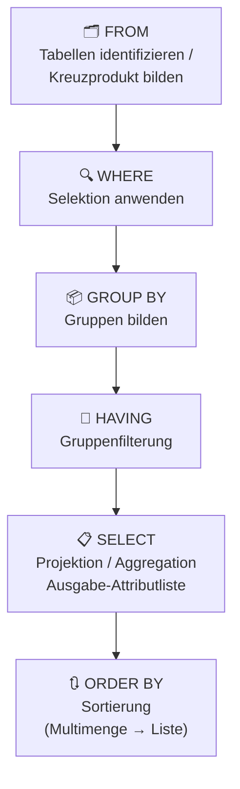
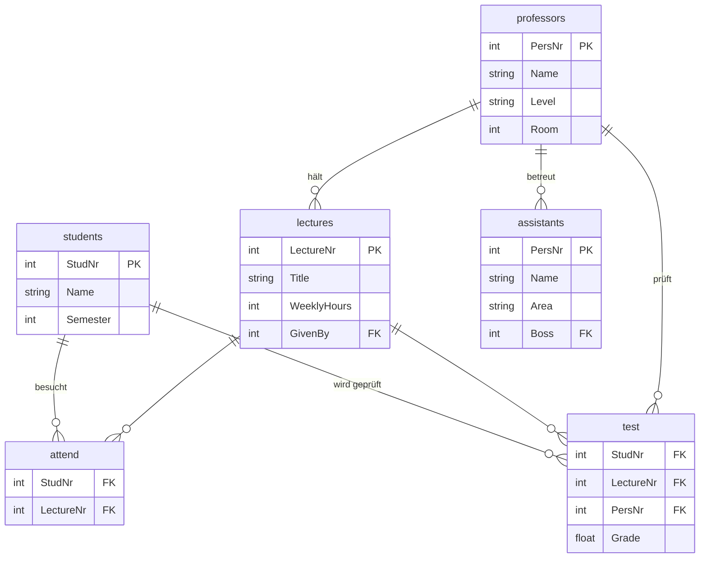

**Class:** [[ISDA - Informationsysteme und Datenanalyse]]  
**Date:** 02-05-2026  
**Topics:** #SQL #DQL #Datenbankabfragen #Aggregation #GeschachtelteAnfragen #RelationaleAlgebra  
**Link:** [[VL.08 ISDA.pdf]]

***

## 🎯 Lernziele der Vorlesung

SQL (Structured Query Language) ist die *deklarative*, nicht-prozedurale Standardanfragesprache für relationale Datenbanken. Diese Vorlesung legt den Grundstein für die vollständige Spezifikation einfacher bis hochkomplexer Datenbankabfragen.

- **SQL-Grundgerüst**: Aufbau und konzeptuelle Auswertungsreihenfolge der sechs Klauseln (SELECT · FROM · WHERE · GROUP BY · HAVING · ORDER BY)
- **Einfache Anfragen**: Projektion, Selektion, Umbenennung, Stringvergleiche, NULL-Werte, ternäre Logik, Aggregation, Sortierung, Duplikateliminierung
- **Mehrrelationen-Anfragen**: Kreuzprodukt, Join, Tupelvariablen, Mengenoperationen (UNION / INTERSECT / EXCEPT)
- **Geschachtelte Anfragen**: Skalare Subanfragen, Subanfragen in FROM, Bedingungen mit EXISTS / IN / ALL / ANY
- **Korrelierte vs. unkorrelierte Anfragen**: Unterschied, Effizienz und Anwendung

***

## 1. Einführung & Motivation

### Vorwissen: Relationale Algebra

Die **Relationale Algebra** ist eine theoretische *prozedurale* Anfragesprache zur Manipulation von Relationen und bildet die formale Grundlage für SQL.

| Kategorie | Operatoren |
|-----------|-----------|
| **Basisoperatoren** | Vereinigung $\cup$, Differenz $-$, Kartesisches Produkt $\times$, Projektion $\pi$, Selektion $\sigma$, Umbenennung $\rho$ |
| **Abgeleitete Operatoren** | Schnitt $\cap$, Theta-Join $\bowtie_\theta$, Natürlicher Verbund $\bowtie$, Division $\div$ |
| **Erweiterungen** | Aggregation $\gamma$, Gruppierung, Sortierung $\tau$ |

**Vollständigkeit & Abgeschlossenheit:** Jeder Ausdruck über Relationen liefert wieder eine Relation (Abgeschlossenheit). Die Basisoperatoren bilden eine vollständige Basis.

### Motivation für SQL

> [!info] **SQL ist der relationale Datenbankstandard**
>  – verbreitetste Anfragesprache weltweit.

**Eigenschaften:**
- **Ad-hoc und einfach**: Direkte Formulierung ohne Programmierkenntnisse notwendig
- **Deklarativ**: Man beschreibt *WAS* man möchte, nicht *WIE* es berechnet wird
- **Nicht prozedural**: Kein expliziter Ausführungsplan
- **Optimierbar**: Das DBMS wählt selbst den günstigsten Ausführungsplan
- Angelehnt an relationale Algebra (DQL) + Datenmanipulationssprache (DML)

> [!warning] **Systemabhängigkeit**: Syntax und Funktionalität können sich von System zu System leicht unterscheiden!

***

## 2. Basisgerüst von SQL

### Definition: SQL-Grundstruktur

$$\boxed{
\begin{aligned}
&\texttt{SELECT } \langle\text{Attribut- und Funktionsliste}\rangle \\
&\texttt{FROM } \langle\text{Tabellenliste}\rangle \\
&[\texttt{WHERE}]\ \langle\text{Bedingung}\rangle \\
&[\texttt{GROUP BY}]\ \langle\text{Gruppierungsattribute}\rangle \\
&[\texttt{HAVING}]\ \langle\text{Gruppenbedingung}\rangle \\
&[\texttt{ORDER BY}]\ \langle\text{Attributliste}\rangle
\end{aligned}
}$$

> [!tip] **Merkhilfe Auswertungsreihenfolge**: `FROM` → `WHERE` → `GROUP BY` → `HAVING` → `SELECT` → `ORDER BY`

### Konzeptuelle Auswertungsreihenfolge



**Wichtige Regeln:**

- Nur `SELECT` und `FROM` sind **zwingend erforderlich**; alle anderen Klauseln sind optional.
- `FROM` identifiziert alle beteiligten Tabellen (oder materialisiert Kreuzprodukte).
- `ORDER BY` wandelt die Multimenge des Ergebnisses in eine **geordnete Liste** um.
- Das Anfrageergebnis ist die in `SELECT` spezifizierte Attributliste.

---

## 3. Einfache Anfragen

### 3.1 Alle Tupel ausgeben (Wildcard `*`)

```sql
SELECT * FROM table
```

**Relational:** `table` (Identitätsoperation)

```sql
-- Beispiel: Alle Studenten ausgeben
SELECT * FROM students
```

### 3.2 Projektion

$$\boxed{\texttt{SELECT } \textit{attr} \texttt{ FROM } \textit{table} \quad \longleftrightarrow \quad \pi_{\textit{attr}}(\textit{table})}$$

```sql
-- Einfache Projektion
SELECT name, semester FROM students

-- Erweiterte Projektion mit Ausdruck
SELECT name, semester*5 FROM students

-- Umbenennung MIT as (explizit)
SELECT name AS n, semester*5 AS stf FROM students

-- Umbenennung OHNE as (implizit, gleichwertig)
SELECT name n, semester*5 stf FROM students
```

> [!tip] **Umbenennung**: Mit `AS alias` oder direkt `ausdruck alias` – beide Formen sind identisch.

### 3.3 Selektion (WHERE-Klausel)

$$\boxed{\texttt{SELECT } \textit{attr} \texttt{ FROM } \textit{table} \texttt{ WHERE } \textit{condition} \quad \longleftrightarrow \quad \pi_{\textit{attr}}(\sigma_{\textit{condition}}(\textit{table}))}$$

```sql
-- Studenten im 4.–9. Semester
SELECT name, semester FROM students
WHERE semester > 3 AND semester < 10
-- → Aristoxenos (8), Schopenhauer (6)
```

**Vergleichsoperatoren:** `=`, `<>`, `<`, `>`, `<=`, `>=`

**Logische Verknüpfungen:** `AND`, `OR`, `NOT` – Klammerungen erlaubt

**Operanden in WHERE:**

- Konstanten und Attributnamen
- Auch Attribute, die **nicht** in SELECT genannt sind
- Arithmetische Ausdrücke: `(Jahr - 1930) * (Jahr - 1930) < 100`
- String-Konkatenation: `'Star' || 'Wars'` → `'StarWars'`

> [!info] Nur wenn das Prädikat für ein Tupel zu **TRUE** auswertet, wird das Tupel ins Ergebnis aufgenommen.

### 3.4 Stringvergleiche & LIKE

**Vergleiche** mit `<`, `>`, `<=`, `>=`: lexikographisch (`'fodder' < 'foo'`, `'bar' < 'bargain'`)

**Patternmatching:**

$$\boxed{\texttt{string LIKE pattern} \quad \text{bzw.} \quad \texttt{string NOT LIKE pattern}}$$

|Platzhalter|Bedeutung|
|---|---|
|`%`|Beliebige Sequenz von 0 oder mehr Zeichen|
|`_`|Genau ein beliebiges Zeichen|

```sql
-- Findet "Star Wars" und "Star Trek" (je 4 weitere Zeichen)
SELECT Titel FROM Film WHERE Titel LIKE 'Star _ _ _ _'

-- Alle Filme mit 's' irgendwo im Titel
SELECT Titel FROM Film WHERE Titel LIKE '%s%'
```

### 3.5 Datum und Uhrzeit

|Typ|Format|Beispiel|
|---|---|---|
|`DATE`|`'YYYY-MM-DD'`|`DATE '1948-05-14'`|
|`TIME`|`'HH:MM:SS.S'`|`TIME '15:00:02.5'`|
|`TIMESTAMP`|`'YYYY-MM-DD HH:MM:SS.S'`|`TIMESTAMP '1948-05-14 15:00:02.5'`|

```sql
TIME '15:00:02.5' < TIME '15:02:02.5'   -- ergibt TRUE
DATE '1948-05-14' >= DATE '1949-11-12'  -- ergibt FALSE
```

### 3.6 Nullwerte (NULL)

$$\boxed{\text{NULL} \quad (\text{auch: } \bot) \quad \text{— kein Wert, nicht 0, nicht leer}}$$

**Drei Interpretationen:**

- [n] **Unbekannter Wert**: Geburtstag eines Schauspielers
- [n] **Unzulässiger Wert**: Ehegatte eines Unverheirateten
- [n] **Unterdrückter Wert**: Geheime Telefonnummer

**Regeln für NULL:**

|Ausdruck (x ist NULL)|Ergebnis|
|---|---|
|`x + 3`|**NULL**|
|`NULL + 3`|**kein zulässiger Ausdruck**|
|`x = 3`|**UNKNOWN**|
|Jede Arithmetik mit NULL|**NULL**|
|Jeder Vergleich mit NULL|**UNKNOWN**|

```sql
-- Abfragen auf NULL-Werte
WHERE Geburtstag IS NULL
WHERE Geburtstag IS NOT NULL
```

> [!warning] **NULL ist keine Konstante!** NULL erscheint nur als Attributwert, nicht als eigenständiger Ausdruck. `NULL + 3` ist syntaktisch **ungültig**.

### 3.7 Ternäre Logik (TRUE / FALSE / UNKNOWN)

Prädikate in SQL liefern drei Wahrheitswerte: `TRUE`, `FALSE`, `UNKNOWN`.

**AND-Tabelle:**

|AND|TRUE|UNKNOWN|FALSE|
|---|---|---|---|
|**TRUE**|TRUE|UNKNOWN|FALSE|
|**UNKNOWN**|UNKNOWN|UNKNOWN|FALSE|
|**FALSE**|FALSE|FALSE|FALSE|

**OR-Tabelle:**

|OR|TRUE|UNKNOWN|FALSE|
|---|---|---|---|
|**TRUE**|TRUE|TRUE|TRUE|
|**UNKNOWN**|TRUE|UNKNOWN|UNKNOWN|
|**FALSE**|TRUE|UNKNOWN|FALSE|

**NOT-Tabelle:**

|NOT|Ergebnis|
|---|---|
|TRUE|FALSE|
|UNKNOWN|UNKNOWN|
|FALSE|TRUE|

> [!tip] **Eselsbrücke**: TRUE = 1, FALSE = 0, UNKNOWN = ½
> 
> - **AND** = Minimum der Werte
> - **OR** = Maximum der Werte
> - **NOT** = 1 − Wert
> 
> **Rechenbeispiel:** $$
\begin{aligned}
&\text{TRUE AND (FALSE OR NOT(UNKNOWN))} \\[4pt]
&= \min\left(1, \max\left(0, 1 - \frac{1}{2}\right)\right) \\[4pt]
&= \min\left(1, \frac{1}{2}\right) \\[4pt]
&= \frac{1}{2} \\[4pt]
&= \text{UNKNOWN}
\end{aligned}
$$

> [!failure] **Überraschendes NULL-Verhalten:**
> 
> ```sql
> SELECT * FROM Film WHERE Länge <= 90 OR Länge > 90
> ```
> 
> Ein Tupel mit `Länge = NULL`: Beide Bedingungen liefern UNKNOWN → OR → UNKNOWN → **Tupel wird nicht aufgenommen**, obwohl man die gesamte Relation erwartet!

### 3.8 Aggregation

$$\boxed{\texttt{SELECT agg(attr) AS alias FROM table [WHERE cond]}}$$

**Relational:** $\pi_{a_1,\ldots}!\left(\gamma_{\text{agg}(\text{attr}) \to a_1,\ldots}!\left(\sigma_{\text{cond}}(\text{table})\right)\right)$

```sql
SELECT count(*) c FROM students
-- → c = 8

SELECT count(*) c, avg(semester) a FROM students
-- → c = 8, a = 7.6250
```

**Aggregationsfunktionen:**

|Funktion|Bedeutung|
|---|---|
|`count(*)`|Anzahl aller Tupel (inkl. NULL)|
|`count(attr)`|Anzahl Nicht-NULL-Werte|
|`max(attr)`|Maximaler Wert|
|`min(attr)`|Minimaler Wert|
|`avg(attr)`|Arithmetischer Mittelwert|
|`sum(attr)`|Summe aller Werte|

### 3.9 Gruppierte Aggregation (GROUP BY / HAVING)

$$\boxed{\texttt{SELECT attr, agg(attr) FROM table [WHERE cond] GROUP BY gattr [HAVING hcond]}}$$

```sql
-- Anzahl Studenten pro Semester
SELECT semester, count(*) FROM students GROUP BY semester
```

> [!warning] **Wichtige Einschränkung:** Alle in SELECT genannten _nicht-aggregierten_ Attribute müssen eine Teilmenge der GROUP BY-Attribute sein: $$\text{SELECT-Attribute} \subseteq \text{GROUP BY-Attribute}$$ Sonst ist kein eindeutiger Wert pro Gruppe bestimmbar!

**HAVING – Gruppenfilterung:**

```sql
-- Nur Semester mit mehr als einem Studenten
SELECT semester, count(*) FROM students
GROUP BY semester
HAVING count(*) > 1
-- → Semester 2, count = 2
```

**WHERE vs. HAVING:**

|Klausel|Wann angewendet|Filtert|
|---|---|---|
|`WHERE`|Vor Gruppierung|Einzelne Tupel|
|`HAVING`|Nach Gruppierung|Ganze Gruppen|

### 3.10 Sortierung (ORDER BY)

$$\boxed{\texttt{ORDER BY } \textit{spalte} \texttt{ [ASC|DESC]}, \ldots}$$

```sql
SELECT * FROM students ORDER BY semester ASC, name DESC
```

|Schlüsselwort|Bedeutung|
|---|---|
|`ASC`|Ascending / Aufsteigend (**Default**)|
|`DESC`|Descending / Absteigend|

> [!info] `ORDER BY` wandelt die **Multimenge** in eine geordnete **Liste** um.

### 3.11 Duplikateliminierung (DISTINCT)

$$\boxed{\texttt{SELECT DISTINCT} \ldots \quad \longleftrightarrow \quad \delta(\text{Anfrage ohne DISTINCT})}$$

```sql
-- Alle vorhandenen Semesterwerte (ohne Duplikate)
SELECT DISTINCT semester FROM students
-- → 7 eindeutige Werte (statt 8 Tupel)

-- DISTINCT auch innerhalb von Aggregationsfunktionen
SELECT count(DISTINCT semester) FROM students
-- → 7
```

> [!warning] **DISTINCT ist teuer!** Intern wird eine Sortierung durchgeführt → Multimenge wird zur Menge.

### 3.12 Groß- und Kleinschreibung

- SQL-**Schlüsselwörter** und **Attribut-/Relationennamen**: **case-insensitive**
    - `From = FROM = from = FrOm` ✓
- **String-Konstanten** (in Anführungszeichen): **case-sensitive**
    - `'FROM' ≠ 'from' ≠ from` (letztes ist ein Bezeichner, nicht eine Konstante)

---

## 4. Anfragen über mehrere Relationen

### 4.1 Beispielschema: Universität_DB

Ausprobierbar unter: https://hyper-db.de/interface.html



### 4.2 Kreuzprodukt (Kartesisches Produkt)

$$\boxed{\mathtt{SELECT * FROM table1, table2, \ldots} \quad \longleftrightarrow \quad \text{table1} \times \text{table2} \times \ldots}$$

```sql
-- Jeder Assistent mit jedem Professor → 7 × 6 = 42 Zeilen, 8 Spalten
SELECT * FROM assistants, professors
```

> [!warning] SQL lässt **doppelte Attributnamen** in der Ergebnisrelation zu! Bei Namenskonflikten muss der Relationenname als Präfix verwendet werden.

### 4.3 JOIN (Kreuzprodukt + WHERE-Bedingung)

Ein JOIN ist konzeptuell ein Kreuzprodukt, bei dem die WHERE-Klausel sinnlose Kombinationen herausfiltert.

```sql
-- Jeden Assistenten mit seinem direkten Vorgesetzten verknüpfen
SELECT * FROM assistants, professors
WHERE professors.persnr = boss
-- → 6 sinnvolle Zeilen (nicht 42)
```

> [!tip] **JOIN = Kreuzprodukt + WHERE**: Die JOIN-Bedingung in der WHERE-Klausel filtert aus $n \times m$ Zeilen nur die relevanten heraus.

### 4.4 Uneindeutige Attributnamen

Bei gleichen Attributnamen aus mehreren Relationen: **Relationenname (oder Alias) als Präfix**.

```sql
-- Schauspieler und Manager an gleicher Adresse finden
SELECT Schauspieler.Name, Manager.Name
FROM Schauspieler, Manager
WHERE Schauspieler.Adresse = Manager.Adresse
```

> [!info] Präfix ist auch bei eindeutigen Namen erlaubt und verbessert die Lesbarkeit von Anfragen erheblich.

### 4.5 Tupelvariablen (Alias)

Tupelvariablen sind **Aliase** für Relationen in der FROM-Klausel. Sie sind **zwingend erforderlich** bei der mehrfachen Verwendung derselben Relation (Self-Join).

```sql
-- Self-Join: Schauspieler, die zusammen wohnen
SELECT Star1.Name, Star2.Name
FROM Schauspieler Star1, Schauspieler Star2
WHERE Star1.Adresse = Star2.Adresse

-- Abkürzende Schreibweise (kein Self-Join)
SELECT S.Name, M.Name
FROM Schauspieler S, Manager M
WHERE S.Adresse = M.Adresse
```

> [!note] Ohne explizite Tupelvariable wird der **Relationsname selbst** als Tupelvariable verwendet.

### 4.6 Mengenoperationen

$$\boxed{\text{UNION} \mid \text{INTERSECT} \mid \text{EXCEPT}}$$

|Operation|SQL|Bedeutung|
|---|---|---|
|Vereinigung|`UNION`|Alle Tupel aus R und S|
|Schnittmenge|`INTERSECT`|Nur gemeinsame Tupel|
|Differenz|`EXCEPT`|Tupel in R, aber nicht in S|

```sql
-- Weibliche Schauspielerinnen, die auch gut verdienende Managerinnen sind
(SELECT s.Name, s.Adresse FROM Schauspieler s WHERE s.Geschlecht = 'F')
INTERSECT
(SELECT m.Name, m.Adresse FROM Manager m WHERE m.Gehalt > 1000000)

-- Schauspieler, die KEINE Manager sind
(SELECT s.Name, s.Adresse FROM Schauspieler s)
EXCEPT
(SELECT m.Name, m.Adresse FROM Manager m)

-- Alle Filmtitel aus Film-Tabelle UND spielt_in vereinigen
(SELECT f.Titel, f.Jahr FROM Film f)
UNION
(SELECT sp.FilmTitel AS Titel, sp.FilmJahr AS Jahr FROM spielt_in sp)
```

> [!warning] **Mengensemantik**: `UNION`, `INTERSECT`, `EXCEPT` entfernen automatisch Duplikate (wandeln Multimengen in Mengen um).
> 
> Um Duplikate zu **behalten** → `ALL`-Suffix verwenden:
> 
> ```sql
> (SELECT Titel, Jahr FROM Film) UNION ALL (SELECT FilmTitel, FilmJahr FROM spielt_in)
> -- Film mit 3 Schauspielern erscheint 4 Mal (1× Film + 3× spielt_in)
> ```
> 
> Analog: `INTERSECT ALL`, `EXCEPT ALL`

### 4.7 Komplexe Spezifikationsbeispiele

**Beispiel I:** Welche Studenten müssen im ISDA-Modul im 3. Versuch mündlich geprüft werden?

```sql
-- Relational: π_{MatrNr, Name}(Student ⋈ (σ_{MName='ISDA'}(Modul)) ⋈ (σ_{Note=5 ∧ Versuch=2}(Besucht)))
SELECT s.MatrNr, s.Name
FROM Student AS s, Modul AS m, Besucht AS hb
WHERE s.MatrNr = hb.MatrNr
  AND m.ModNr = hb.ModNr
  AND m.MName = 'ISDA'
  AND hb.Note = 5.0
  AND hb.Versuch = 2
```

**Beispiel II:** Durchschnittsnoten im 1. Versuch, SS2021, Modul ISDA

```sql
SELECT m.MName, AVG(Note) AS Notendurchschnitt
FROM Modul AS m, Besucht AS hb
WHERE m.ModNr = hb.ModNr
  AND hb.Versuch = 1
  AND hb.Sem = 'SS2021'
GROUP BY m.MName
HAVING m.MName = 'ISDA'
```

> [!note] Beispiele können mit **Relax** online getestet werden: https://dbis-uibk.github.io/relax/

---

## 5. Geschachtelte Anfragen (Subqueries)

### 5.1 Motivation & Anwendungsmöglichkeiten

Eine Anfrage kann Teil einer anderen Anfrage sein – beliebig tief geschachtelt.

- [i] **Skalare Subanfrage** → liefert genau 1 Wert → verwendbar wie eine Konstante in WHERE
- [i] **Subanfrage in WHERE** → liefert eine Relation → verwendbar mit EXISTS / IN / ALL / ANY
- [i] **Subanfrage in FROM** → liefert eine Relation → verwendbar wie jede normale Tabelle

### 5.2 Skalare Subanfragen

$$\boxed{\text{Skalare Anfrage: genau 1 Tupel mit 1 Attribut} \Rightarrow \text{Verwendung wie Konstante}}$$

```sql
-- Der Student, der am längsten studiert
SELECT name, semester
FROM students
WHERE semester = (SELECT max(semester) FROM students)
-- → Xenokrates, 18
```

> [!danger] **Laufzeitfehler:** Falls die skalare Subanfrage **kein Tupel** oder **mehr als ein Tupel** liefert, kommt es zu einem Laufzeitfehler!

```sql
-- Produzent von Star Wars (skalare Subanfrage in WHERE)
SELECT m.Name
FROM Manager m
WHERE m.ManagerID = (
    SELECT f.ProduzentID
    FROM Film f
    WHERE f.Titel = 'Star Wars' AND f.Jahr = 1977
)

-- Äquivalent als Join (alternative Formulierung)
SELECT m.Name
FROM Film f, Manager m
WHERE f.Titel = 'Star Wars' AND f.Jahr = 1977
  AND f.ProduzentID = m.ManagerID
```

### 5.3 Subanfragen in der FROM-Klausel

Anstelle einer einfachen Relation kann eine geklammerte Subanfrage stehen. **Ein Alias ist Pflicht!**

```sql
-- Produzenten von Harrison-Ford-Filmen
SELECT m.Name
FROM Manager m,
     (SELECT f.ProduzentID AS ID
      FROM Film f, spielt_in sp
      WHERE f.Titel = sp.FilmTitel
        AND f.Jahr = sp.FilmJahr
        AND sp.Schauspieler = 'Harrison Ford') Produzent
WHERE m.ManagerID = Produzent.ID
```

### 5.4 Bedingungen mit Relationen (EXISTS / IN / ALL / ANY)

$$\boxed{\text{EXISTS} \mid x\ \text{IN}\ R \mid x\ \text{NOT IN}\ R \mid x > \text{ALL}\ R \mid x > \text{ANY}\ R}$$

|Operator|Bedeutung|
|---|---|
|`EXISTS R`|TRUE, falls R **nicht leer** ist|
|`NOT EXISTS R`|TRUE, falls R **leer** ist|
|`x IN R`|TRUE, falls x einem Wert in R entspricht (R einwertig)|
|`x NOT IN R`|TRUE, falls x keinem Wert in R entspricht|
|`x > ALL R`|TRUE, falls x **größer als jeder** Wert in R ist|
|`x <> ALL R`|Entspricht `x NOT IN R`|
|`x > ANY R`|TRUE, falls x **größer als mindestens ein** Wert in R ist|
|`x = ANY R`|Entspricht `x IN R`|

> [!tip] **Negation mit NOT** ist bei allen Operatoren möglich: `NOT EXISTS`, `NOT IN`, `NOT x > ALL`, …

### 5.5 Bedingungen mit Tupeln

IN, ALL und ANY können auf **Tupel** (mehrere Attribute) verallgemeinert werden – erfordert gleiche Schemata und Attributreihenfolge.

```sql
-- Student, der am längsten studiert (mit >= ALL)
SELECT name, semester
FROM students
WHERE semester >= ALL (SELECT semester FROM students)
-- → Xenokrates, 18

-- Produzenten von Harrison-Ford-Filmen (mehrfach geschachtelt, von innen nach außen lesen)
SELECT m.Name
FROM Manager m
WHERE m.ManagerID IN (
    SELECT f.ProduzentID
    FROM Film f
    WHERE (f.Titel, f.Jahr) IN (
        SELECT sp.FilmTitel, sp.FilmJahr
        FROM spielt_in sp
        WHERE sp.SchauspielerName = 'Harrison Ford'
    )
)
```

> [!tip] **Analysetipp:** Geschachtelte Anfragen immer **von innen nach außen** lesen und verstehen.

**Alternative flache Formulierung (oft äquivalent und lesbarer):**

```sql
SELECT m.Name
FROM Manager m, Film f, spielt_in sp
WHERE m.ManagerID = f.ProduzentID
  AND f.Titel = sp.FilmTitel
  AND f.Jahr = sp.FilmJahr
  AND sp.SchauspielerName = 'Harrison Ford'
```

### 5.6 Korrelierte vs. Unkorrelierte SQL-Anfragen

$$\boxed{\text{Korrelierte Anfrage: Subanfrage referenziert Attribute der äußeren Anfrage}}$$

**Korrelierte Anfrage** – mit `NOT EXISTS`:

```sql
-- Dozenten, die kein einziges Modul leiten
SELECT d.Name
FROM Dozent d
WHERE NOT EXISTS (
    SELECT *
    FROM Modul m
    WHERE m.PNr = d.PNr   -- ← Korrelation: d.PNr aus äußerer Anfrage
)
```

**Unkorrelierte Anfrage** – mit `NOT IN` (meist effizienter):

```sql
-- Semantisch äquivalent, aber Subanfrage wird nur EINMAL ausgewertet
SELECT d.Name
FROM Dozent d
WHERE d.PNr NOT IN (SELECT m.PNr FROM Modul m)
```

**Vergleich:**

|Merkmal|Korrelierte Anfrage|Unkorrelierte Anfrage|
|---|---|---|
|Referenz auf äußere Relation|✓ Ja|✗ Nein|
|Auswertung der Subanfrage|Einmal **pro Tupel** der äußeren Anfrage|**Einmal** insgesamt|
|Effizienz|Oft langsamer|Meist effizienter|
|Typischer Operator|`EXISTS` / `NOT EXISTS`|`IN` / `NOT IN`|

> [!warning] **Korrelierte Anfragen** werden für jedes Tupel (oder jede Tupelkombination) der äußeren Anfrage neu ausgewertet → kann bei großen Datenmengen sehr teuer werden!

---

## 📌 Zusammenfassung

### Wichtige Konzepte

|Konzept|Bedeutung|
|---|---|
|**SQL (DQL)**|Deklarative, nicht-prozedurale Datenbankabfragesprache; relativer Standard|
|**SELECT…FROM…WHERE**|Grundgerüst; SELECT und FROM sind zwingend|
|**Projektion**|`SELECT attr` → $\pi_{\text{attr}}$|
|**Selektion**|`WHERE condition` → $\sigma_{\text{condition}}$|
|**Umbenennung**|`attr AS alias` (oder `attr alias`)|
|**LIKE**|Patternmatching: `%` (beliebig viele), `_` (genau eins)|
|**NULL**|Kein Wert; Arithmetik → NULL; Vergleich → UNKNOWN|
|**Ternäre Logik**|TRUE/FALSE/UNKNOWN; AND=min, OR=max, NOT=1−x|
|**Aggregation**|`count`, `max`, `min`, `avg`, `sum`|
|**GROUP BY / HAVING**|Gruppierung; HAVING filtert Gruppen (≠ WHERE filtert Tupel)|
|**ORDER BY**|`ASC` (default) oder `DESC`; Multimenge → Liste|
|**DISTINCT**|Duplikateliminierung; Multimenge → Menge; teuer|
|**Kreuzprodukt**|`FROM t1, t2` → $t_1 \times t_2$|
|**JOIN**|Kreuzprodukt + WHERE-Joinbedingung|
|**Tupelvariablen**|Aliase für Relationen; zwingend bei Self-Join|
|**UNION/INTERSECT/EXCEPT**|Mengenoperationen; entfernen Duplikate; mit `ALL` → Multimengensemantik|
|**Skalare Subanfrage**|Genau 1 Tupel, 1 Attribut → wie Konstante verwendbar|
|**Geschachtelte Anfrage**|Subanfrage innerhalb WHERE oder FROM einer äußeren Anfrage|
|**Korrelierte Anfrage**|Subanfrage referenziert äußere Relation; wird pro Tupel neu ausgewertet|

### Kernaussagen

- [p] **SQL ist deklarativ** – man beschreibt _was_ gesucht wird, das DBMS optimiert die Ausführung selbst
- [p] **Auswertungsreihenfolge**: FROM → WHERE → GROUP BY → HAVING → SELECT → ORDER BY
- [p] **GROUP BY-Pflicht**: Nicht-aggregierte SELECT-Attribute müssen Teilmenge der GROUP BY-Attribute sein
- [p] **UNION/INTERSECT/EXCEPT** verwenden Mengensemantik (Duplikate entfernt); mit `ALL` → Multimengensemantik beibehalten
- [!] **ACHTUNG NULL**: Vergleiche mit NULL liefern UNKNOWN – Tupel mit UNKNOWN werden in WHERE **nicht** aufgenommen
- [!] **ACHTUNG Skalare Subanfrage**: 0 oder >1 Tupel als Ergebnis → **Laufzeitfehler**
- [c] **Korrelierte Anfragen** sind oft ineffizient, da die Subanfrage für jedes Tupel der äußeren Anfrage erneut ausgewertet wird
- [p] **Unkorrelierte Unteranfragen** bevorzugen – werden nur einmal ausgewertet

### Wichtige SQL-Syntax-Referenz

|Operation|SQL|
|---|---|
|Vollständige Anfrage|`SELECT [DISTINCT] attr FROM table [WHERE cond] [GROUP BY gattr [HAVING hcond]] [ORDER BY sattr [ASC\|DESC]]`|
|NULL-Prüfung|`attr IS NULL` / `attr IS NOT NULL`|
|Patternmatching|`attr LIKE '%muster_'`|
|Mengenoperationen|`(Q1) UNION [ALL] (Q2)` / `INTERSECT [ALL]` / `EXCEPT [ALL]`|
|Existenztest|`EXISTS (subquery)` / `NOT EXISTS (subquery)`|
|Mengenmitgliedschaft|`x IN (subquery)` / `x NOT IN (subquery)`|
|Allquantor|`x > ALL (subquery)`|
|Existenzquantor|`x > ANY (subquery)`|
|Subanfrage in FROM|`FROM (...) alias`|

---

## 🔗 Verbindungen zu anderen Vorlesungen

- [[VL.07 Relationale Algebra]]: Relationale Algebra – formale Grundlage für alle SQL-Operationen ($\pi$, $\sigma$, $\rho$, $\gamma$, $\tau$, $\bowtie$)
- [[VL.09 ISDA]]: Data Warehousing – Aufbauend auf SQL; OLAP-Anfragen und analytische Funktionen (Literatur: Kap. 10, §6, §7)
- [[VL.05 Relationale Entwurfstheorie]]: ER-Modellierung & konzeptioneller Entwurf – liefert das Datenbankschema, auf dem SQL-Anfragen operieren
- [[VL.06 Datenbankdarstellung mit SQL]]: Implementierungsentwurf / relationales DB-Schema – Grundlage für alle Tabellenstrukturen