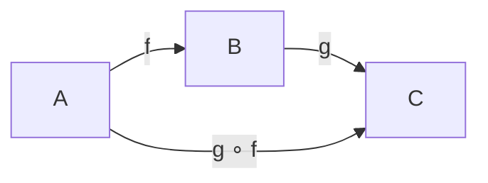

**Class:** [[FoG - Formal-mathematische Grundlagen]]  
**Date:** 04-06-2026  
**Topics:** #Funktionen #Abbildungen #Kardinalität #Cantor #Bijektion  
**Link:** [[VL.07 FoG.pdf]]

***

## 🎯 Lernziele der Vorlesung

Diese Vorlesung behandelt **Abbildungen/Funktionen** als Spezialfall von Relationen sowie **Kardinalitäten** und den Vergleich von Mengengrößen – auch unendlicher Mengen.

- **Partielle & totale Abbildung**: Funktionen als rechtseindeutige (und linkstotale) Relationen
- **Eigenschaften**: Injektivität, Surjektivität, Bijektivität und deren Zusammenhang mit LT/LE/RE/RT
- **Algebra von Funktionen**: Umkehrabbildung, Komposition, Kürzbarkeit
- **Kardinalität**: Vergleich von Mengengrößen via Bijektionen und Injektionen
- **Abzählbarkeit**: Abzählbare vs. überabzählbare Mengen
- **Cantors Theorem**: Potenzmenge hat immer echt größere Kardinalität

***

## 1. Abschnitt: Abbildungen als Relationen

### Definition 8.1.1 – Partielle Abbildung

Eine **Relation** $f : (A, B)$ heißt **partielle Abbildung**, wenn sie **rechtseindeutig** ist.

$$\boxed{f : A \rightharpoonup B \quad \Longleftrightarrow \quad f \text{ ist rechtseindeutig}}$$

**Begriffe:**
- $(a, b) \in f \Rightarrow$ schreibe $f(a) = b$ oder $a \xrightarrow{f} b$ oder $a \mapsto b$
- $f(a)$ = **Wert von** $f$ **an der Stelle** $a$
- $A$ = **Argumentbereich / Domain**: $\text{dom}(f)$
- $B$ = **Zielbereich / Codomain**: $\text{cod}(f)$

**Bild und Urbild** von Teilmengen $A_0 \subseteq A$, $B_0 \subseteq B$:

$$f(A_0) \triangleq \{ b \in B \mid \exists a \in A_0 \,.\, f(a) = b \}$$

$$f^{-1}(B_0) \triangleq \{ a \in A \mid \exists b \in B_0 \,.\, f(a) = b \}$$

**Bildbereich und Definitionsbereich:**

$$\text{Bild}(f) \triangleq f(A), \qquad \text{Def}(f) \triangleq f^{-1}(B)$$

**Totale Abbildung:** $f$ heißt **totale Abbildung** $f : A \to B$, falls $f$ zusätzlich **linkstotal** ist, d.h. $\text{Def}(f) = \text{dom}(f)$.

$$\boxed{\text{Relation} \xrightarrow{+ \text{ RE}} \text{partielle Abbildung} \xrightarrow{+ \text{ LT}} \text{totale Abbildung}}$$

> [!info] **Merkhilfe:** Eine Abbildung ist wie eine Funktion im Programmiersinne: jedem Eingabewert (aus dem Definitionsbereich) ist **höchstens ein** Ausgabewert zugeordnet (RE = rechtseindeutig). Ist sie **für alle** Eingaben definiert, heißt sie **total** (LT = linkstotal).

***

### Definition 8.1.2 – Berechnungsvorschrift

Partielle Funktionen werden oft per **Fallunterscheidung** definiert:

$$f : A \rightharpoonup B; \quad a \mapsto \begin{cases} \text{Ber}_1(a) & ; P_1(a) \\ \text{Ber}_2(a) & ; P_2(a) \\ \dots \end{cases}$$

**Wohldefiniertheit:** Kein $a \in A$ darf zwei **verschiedene** Werte zugewiesen bekommen. Wenn $P_j(a) \equiv \top \equiv P_k(a)$ für $j \neq k$, dann muss $\text{Ber}_j(a) = \text{Ber}_k(a)$ gelten.

> [!example] **Beispiel:**
> $$f: \mathbb{N} \rightharpoonup \mathbb{N}^+; \quad f = \begin{cases} 1 \mapsto 39 \\ 2 \mapsto 1 \\ 42 \mapsto 65536 = 2^{16} \\ n \mapsto n/2 & ; n \text{ gerade}, n \neq 42, n \neq 0 \end{cases}$$
> - $f(2^{17}) = 2^{16}$  
> - $\text{Bild}(f) = \{39, 1, 65536\} \cup (\mathbb{N} \setminus \{0, 21\})$  
> - $\text{Def}(f) = \{1, 2, 42\} \cup \{n \in \mathbb{N} \setminus \{0\} \mid n \text{ gerade}\}$

***

### Proposition 8.1.3 – Gleichheit partieller Abbildungen

Zwei partielle Abbildungen $f_1 : A_1 \rightharpoonup B_1$ und $f_2 : A_2 \rightharpoonup B_2$ sind **gleich**, falls:

$$\boxed{A_1 = A_2 \;\wedge\; B_1 = B_2 \;\wedge\; \text{Def}(f_1) = \text{Def}(f_2) \;\wedge\; \forall x \in \text{Def}(f_1).\; f_1(x) = f_2(x)}$$

> [!example] **Beispiel:**
> - $f_1 : \mathbb{N} \rightharpoonup \mathbb{N};\; n \mapsto n+1$ und $f_2 : \mathbb{N}^+ \rightharpoonup \mathbb{N}^+;\; n \mapsto n+1$ → **nicht gleich** (verschiedene Domains)
> - $g_1 : \mathbb{R} \rightharpoonup \mathbb{R};\; x \mapsto \frac{x^2 - 2x + 3x - 6}{(x-2)(x+3)}$ und $g_2 : \mathbb{R} \rightharpoonup \mathbb{R};\; y \mapsto y^2 + y - 6$ → **gleich** (gleicher Definitionsbereich und gleiche Werte)

***

### Definition 8.1.4 – Eigenschaften partieller Abbildungen

| Begriff | LT | LE | RE | RT |
|---|:---:|:---:|:---:|:---:|
| partielle Abbildung | | | ● | |
| **Abbildung** (total) | ● | | ● | |
| injektive partielle Abbildung | | ● | ● | |
| surjektive partielle Abbildung | | | ● | ● |
| bijektive partielle Abbildung | | ● | ● | ● |
| **Bijektion** | ● | ● | ● | ● |

> [!info] **Merkhilfe LT/LE/RE/RT:**  
> - **LT** = Linkstotal: jedes $a \in A$ hat mindestens einen Partner in $B$  
> - **RT** = Rechtstotal: jedes $b \in B$ hat mindestens einen Partner in $A$ (= surjektiv)  
> - **LE** = Linkseindeutig: je zwei verschiedene $a_1, a_2$ teilen sich kein $b$ (= injektiv aus Sicht von $B \to A$)  
> - **RE** = Rechtseindeutig: jedes $a$ hat **höchstens einen** Wert in $B$ (= Funktionseigenschaft)

***

### Definition 8.1.5 – Isomorphie

$$\boxed{A \cong B \quad \Longleftrightarrow \quad \exists\, f: A \to B \text{ Bijektion}}$$

> [!tip] **Bedeutung in der Informatik:** Isomorphie bedeutet **Perspektivwechsel**! Zwei isomorphe Strukturen sind „im Wesentlichen gleich". Beispiel: Binär- vs. Dezimaldarstellung von Zahlen.

***

## 2. Abschnitt: Algebra von Abbildungen

### Proposition 8.2.1 – Umkehrabbildung I

$$\boxed{f : A \rightharpoonup B \text{ injektiv} \;\Rightarrow\; f^{-1}: B \rightharpoonup A \text{ injektive partielle Abbildung}, \quad (f^{-1})^{-1} = f}$$

> [!warning] **Achtung:** Die Umkehrrelation $f^{-1}$ einer beliebigen partiellen Abbildung ist **nicht** automatisch rechtseindeutig! Nur wenn $f$ **injektiv** ist, wird $f^{-1}$ wieder eine (injektive partielle) Abbildung.

***

### Theorem 8.2.2 – Komposition partieller Abbildungen

$$\boxed{f: A \rightharpoonup B,\; g: B \rightharpoonup C \;\Rightarrow\; (g \circ f): A \rightharpoonup C \text{ partielle Abbildung}}$$

Außerdem gilt für alle $x \in \text{Def}(g \circ f)$:

$$(g \circ f)(x) = g(f(x))$$

> [!note] **Hinweis:** $\text{Def}(g \circ f) = \{ x \in \text{Def}(f) \mid f(x) \in \text{Def}(g) \}$

***

### Proposition 8.2.3 – Umkehrabbildung II (Charakterisierung Bijektion)

Eine Abbildung $f : A \to B$ ist genau dann eine **Bijektion**, wenn es eine Abbildung $g : B \to A$ gibt mit:

$$\boxed{(g \circ f)(a) = a \; \forall a \in A \quad \text{und} \quad (f \circ g)(b) = b \; \forall b \in B}$$

Außerdem gilt: $g = f^{-1}$.

***

### Theorem 8.2.4 – Kürzbarkeit

Seien $f: A \to B$, $g_1, g_2: B \to C$, $h: C \to D$ Abbildungen. Dann gilt:

$$\boxed{f \text{ surjektiv} \;\Rightarrow\; (g_1 \circ f = g_2 \circ f \;\Rightarrow\; g_1 = g_2)}$$

$$\boxed{h \text{ injektiv} \;\Rightarrow\; (h \circ g_1 = h \circ g_2 \;\Rightarrow\; g_1 = g_2)}$$

> [!tip] **Merkhilfe:** Surjektion erlaubt **Kürzen von rechts**, Injektion erlaubt **Kürzen von links**.

***

## 3. Abschnitt: Kardinalitäten

### Definition 8.3.1 – Größe von Mengen (formal)

$$\boxed{A \text{ endlich} \;\Longleftrightarrow\; \exists n \in \mathbb{N}.\; \exists f: A \to [n] \text{ Bijektion}, \quad \#(A) \triangleq n}$$

Falls kein solches $n$ existiert: $A$ **unendlich**, $\#(A) \triangleq \infty$.

Konventionen für $\infty$:
- $\infty + n = \infty$
- $\infty - n = \infty$  
- $n < \infty$ für alle $n \in \mathbb{N}$

***

### Proposition 8.3.2 – Inklusion-Exklusion

Für endliche Mengen $A, B$:

$$\boxed{\#(A \cup B) = \#(A) + \#(B) - \#(A \cap B)}$$

***

### Definition 8.3.3 – Kardinalität (Mächtigkeitsvergleich)

| Aussage | Bedeutung | Bedingung |
|---|---|---|
| $\text{card}(A) = \text{card}(B)$ | gleiche Kardinalität / **äquipotent** | $\exists$ Bijektion $A \to B$ |
| $\text{card}(A) \leq \text{card}(B)$ | höchstens so groß | $\exists$ Injektion $A \to B$ |
| $\text{card}(A) < \text{card}(B)$ | echt kleiner | $\leq$ und $\neq$ |

> [!info] **Beobachtung:** Zwei unendliche Mengen $A, B$ mit $\#(A) = \#(B) = \infty$ können trotzdem $\text{card}(A) < \text{card}(B)$ haben – sie sind dann **„unterschiedlich unendlich"**!

> [!warning] **Notation:** In der Literatur bezeichnet $|A|$ manchmal $\#(A)$ (Anzahl), manchmal $\text{card}(A)$ (Kardinalität). Bei unendlichen Mengen → **Mehrdeutigkeit**!

***

### Definition 8.3.5 – Abzählbarkeit

$$\boxed{A \text{ abzählbar} \;\Longleftrightarrow\; A \text{ endlich} \;\vee\; A \text{ äquipotent zu } \mathbb{N}}$$

- **abzählbar unendlich**: $A$ äquipotent zu $\mathbb{N}$  
- **überabzählbar**: $\text{card}(\mathbb{N}) < \text{card}(A)$

***

### Proposition 8.3.6 – Größe von Zahlenmengen

$$\#(\mathbb{N}) = \#(\mathbb{Z}) = \#(\mathbb{Q}) = \#(\mathbb{R}) = \infty$$

$$\text{card}(\mathbb{N}) = \text{card}(\mathbb{Z}) = \text{card}(\mathbb{Q})$$

$$\boxed{\text{card}(\mathbb{Q}) < \text{card}(\mathbb{R})}$$

> [!example] **Bijektion $\mathbb{N} \to \mathbb{Z}$ (Beweis card(N) = card(Z)):**
> $$b: \mathbb{N} \to \mathbb{Z}; \quad n \mapsto \begin{cases} -\frac{n}{2} & ; n \text{ gerade} \\ \frac{n+1}{2} & ; n \text{ ungerade} \end{cases}$$
> Abzählung: $0 \mapsto 0,\; 1 \mapsto 1,\; 2 \mapsto -1,\; 3 \mapsto 2,\; 4 \mapsto -2, \dots$

> [!example] **Cantors 1. Diagonalverfahren (card(N) = card(Q)):**
> $\mathbb{Q}^+ = \{ \frac{p}{q} \mid p, q \in \mathbb{N}^+, \text{ teilerfremd} \}$ kann durch Diagonalisierung einer $p$-$q$-Matrix bijektiv auf $\mathbb{N}$ abgebildet werden → $\mathbb{Q}^+$ ist abzählbar.

***

## 4. Abschnitt: Cantors Theorem

### Theorem 8.3.7 – Cantor

$$\boxed{\text{card}(A) < \text{card}(\mathcal{P}(A)) \quad \text{für jede Menge } A}$$

**Relevanz:** $\text{card}(\mathcal{P}(A)) < \text{card}(\mathcal{P}(\mathcal{P}(A))) < \dots$ → Es gibt **unendlich viele Unendlichkeiten**!

***

### Beweis von Theorem 8.3.7

Zu zeigen: **(I)** $\text{card}(A) \leq \text{card}(\mathcal{P}(A))$ und **(II)** $\text{card}(A) \neq \text{card}(\mathcal{P}(A))$.

**Zu (I):** Definiere $f: A \to \mathcal{P}(A);\; a \mapsto \{a\}$.

Diese Funktion ist injektiv: $a_1 \neq a_2 \Rightarrow \{a_1\} \neq \{a_2\} = f(a_2)$. ✓

**Zu (II):** Beweis durch Widerspruch (PBC).

Annahme $\varphi_B$: $\exists\, g: A \to \mathcal{P}(A)$ Bijektion, also insbesondere **surjektiv** ($\varphi_S$).

Definiere:

$$D \triangleq \{a \in A \mid a \in g(a)\} \subseteq A, \quad C \triangleq \{a \in A \mid a \notin g(a)\} = A \setminus D$$

Da $g$ surjektiv: $\exists\, \hat{c} \in A$ mit $g(\hat{c}) = C$.

Nun Fallunterscheidung:
- **Fall a)** $\hat{c} \in C$: Per Definition von $C$ gilt $\hat{c} \notin g(\hat{c}) = C$ → **Widerspruch** $\bot$
- **Fall b)** $\hat{c} \notin C = g(\hat{c})$: Per Definition von $C$ gilt $\hat{c} \in C$ → **Widerspruch** $\bot$

In beiden Fällen Widerspruch → $\neg \varphi_B$ → kein surjektives $g$ existiert → $\text{card}(A) \neq \text{card}(\mathcal{P}(A))$. $\blacksquare$

> [!note] **Verbindung zu Russells Paradox:** Die Konstruktion $C = \{a \in A \mid a \notin g(a)\}$ ist eine Variante des Russell'schen Paradoxons aus §1.4.2 – dieselbe diagonale Selbstreferenz erzeugt den Widerspruch.

> [!success] **Kernaussage:** Es gibt keine Surjektion von $A$ nach $\mathcal{P}(A)$ – die Potenzmenge ist immer „größer" als die Ausgangsmenge, auch für unendliche Mengen.

***

## 📌 Zusammenfassung

### Wichtige Konzepte

| Konzept | Bedeutung |
|---|---|
| **partielle Abbildung** | rechtseindeutige Relation $f: A \rightharpoonup B$ |
| **totale Abbildung** | rechtseindeutig + linkstotal $f: A \to B$ |
| **Injektion** | linkseindeutig + rechtseindeutig (+ linkstotal) |
| **Surjektion** | rechtseindeutig + rechtstotal (+ linkstotal) |
| **Bijektion** | LT + LE + RE + RT (alle vier) |
| **Isomorphie** | $A \cong B$ ↔ Bijektion zwischen $A$ und $B$ existiert |
| **Kardinalität** | Abstrakte „Größe" einer Menge; Vergleich via Bijektionen/Injektionen |
| **abzählbar** | endlich oder äquipotent zu $\mathbb{N}$ |
| **überabzählbar** | echt größer als $\mathbb{N}$ (z.B. $\mathbb{R}$) |
| **Cantors Theorem** | $\text{card}(A) < \text{card}(\mathcal{P}(A))$ immer |

### Kernaussagen

- [p] **Jede Abbildung ist eine Relation** – aber nicht jede Relation ist eine Abbildung (RE erforderlich)
- [p] **Bijektion** ↔ Umkehrabbildung existiert als totale Abbildung
- [p] **$\mathbb{N}, \mathbb{Z}, \mathbb{Q}$** sind gleich mächtig (alle abzählbar), **$\mathbb{R}$ ist überabzählbar**
- [!] **Achtung:** $\#(A) = \#(B) = \infty$ bedeutet **nicht** card$(A)$ = card$(B)$!
- [c] **Falsch:** „Alle unendlichen Mengen sind gleich groß" – Cantor widerlegt dies

### Wichtige Formeln / Sätze

| Satz | Aussage |
|---|---|
| **Komposition** | $(g \circ f)(x) = g(f(x))$, $(g \circ f): A \rightharpoonup C$ |
| **Umkehrung** | $f$ injektiv $\Rightarrow f^{-1}$ injektive part. Abbildung |
| **Kürzung links** | $h$ injektiv: $h \circ g_1 = h \circ g_2 \Rightarrow g_1 = g_2$ |
| **Kürzung rechts** | $f$ surjektiv: $g_1 \circ f = g_2 \circ f \Rightarrow g_1 = g_2$ |
| **Inklusion-Exklusion** | $\#(A \cup B) = \#(A) + \#(B) - \#(A \cap B)$ |
| **Cantor** | $\text{card}(A) < \text{card}(\mathcal{P}(A))$ |

***

## 🔗 Verbindungen zu anderen Vorlesungen

- [[VL.06 Relationen]]: Abbildungen sind Spezialfälle von Relationen (§7); LT/LE/RE/RT-Eigenschaften
- [[VL.01 Mengen]]: Potenzmenge $\mathcal{P}(A)$ aus §1.5.2 ist zentral für Cantors Theorem
- [[VL.02 Inferenz und Regelschemata]]: Strukturelle Induktion wird für Beweise über Funktionen genutzt
- [[VL.09 FoG – Universalität]]: Funktionen vs. Mengen, anonyme Funktionen ($\lambda$-Notation), Datentypen als Funktionen (§10)