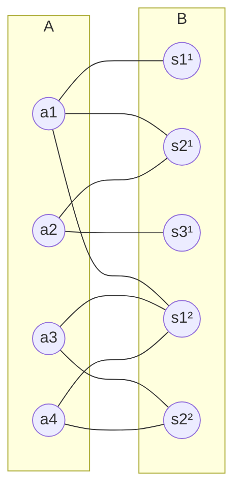

**Class:** [[DS - Diskrete Strukturen]]
**Date:** 04-06-2026
**Topics:** #Matchings #BipartiteGraphen #Satz-von-König #Satz-von-Hall #StabileMatchings
**Link:** [[VL.07 DS.pdf]]

***

## 🎯 Lernziele der Vorlesung

Diese Vorlesung behandelt **Matchings in Graphen** – angefangen bei der Motivation durch Seminar-Themenvergabe, über bipartite Graphen und ihre Charakterisierung, bis hin zu zentralen Sätzen (König, Hall, Gale-Shapley).

- **Bipartite Graphen**: Definition, Charakterisierung via 2-Färbbarkeit und ungerade Kreise
- **Matchings**: Definition, perfekte Matchings, erweiternde Pfade
- **Vertex Cover**: Definition und Beziehung zu Matchings
- **Satz von König**: Dualität max. Matching ↔ min. Vertex Cover (bipartit)
- **Satz von Hall**: Bedingung für Matching von $A$ in bipartitem Graph
- **Stabile Matchings / Gale-Shapley**: Matchings mit Präferenzen
- **Allgemeine Graphen**: Grenzen der Dualität, approximative Ergebnisse

***

## 1. Einleitung: Motivation & Modellierung

### Problemstellung – Seminarvergabe

Studierende $A = \{a_1, \ldots, a_n\}$ müssen Seminarthemen $S = \bigcup_{i=1}^\ell S_i$ zugeteilt bekommen, wobei kein Thema doppelt vergeben werden darf.

**Formale Modellierung als Graph $G$:**
- **Knotenmenge:** $V(G) = A \cup S$
- **Kantenmenge:** $E(G) = \{\{a, s\} : a \in A \text{ interessiert sich für } s \in S\}$
- **Präferenzen:** für jedes $a \in A$ eine lineare Ordnung $\leq_a$ auf $I(a) = \{s \in S : \{a,s\} \in E(G)\}$

> [!example] **Beispiel:** $A = \{a_1, a_2, a_3, a_4\}$, Seminar $S_1$ mit 3 Themen $\{s_1^1, s_2^1, s_3^1\}$, Seminar $S_2$ mit 2 Themen $\{s_1^2, s_2^2\}$.
>
> | Stud. | 1. Wahl | 2. Wahl | 3. Wahl |
> |-------|---------|---------|---------|
> | $a_1$ | $s_1^1$ | $s_2^1$ | $s_1^2$ |
> | $a_2$ | $s_3^1$ | $s_2^1$ | – |
> | $a_3$ | $s_1^2$ | $s_2^2$ | – |
> | $a_4$ | $s_2^2$ | $s_1^2$ | – |

***

## 2. Bipartite Graphen

### Definition – Bipartiter Graph

$$\boxed{G \text{ bipartit} \;\Longleftrightarrow\; V(G) = A \,\dot{\cup}\, B, \;\forall e \in E(G): e \cap A \neq \emptyset \;\wedge\; e \cap B \neq \emptyset}$$

Jede Kante hat einen Endpunkt in $A$ und einen in $B$. $A$ und $B$ heißen **bi-Partitionen** von $G$.

### Definition – $k$-Färbung

$$\boxed{c: V(G) \to \{1, \ldots, k\} \;\text{ mit }\; c(a) \neq c(b) \;\forall \{a,b\} \in E(G)}$$

Eine solche Abbildung heißt **valide** / **proper** $k$-Färbung. $G$ ist **$k$-färbbar**, wenn eine solche Färbung existiert.

> [!info] **Beobachtung:** Ein Graph $G$ ist genau dann bipartit, wenn er **2-färbbar** ist.

***

### Abschlusseigenschaften bipartiter Graphen

1. $G$ bipartit $\Longleftrightarrow$ jede Zusammenhangskomponente von $G$ bipartit
2. $G$ bipartit $\Rightarrow$ jeder Teilgraph von $G$ bipartit

> [!tip] **Merkhilfe:** Bäume (= Wälder) sind bipartit, da sie keine Kreise enthalten.

***

### Lemma – Kreise und Bipartitheit

$$\boxed{C = (v_1, e_1, v_2, \ldots, v_\ell, e_\ell, v_1) \text{ bipartit} \;\Longleftrightarrow\; \ell \text{ gerade}}$$

**Beweis (Skizze):** O.B.d.A. $v_1 \in A$. Dann alternieren die Knoten zwischen $A$ und $B$: $v_i \in A \Leftrightarrow i$ ungerade.
- $\ell$ **gerade**: $v_\ell \in B$, $v_1 \in A$ → verschiedene Partitionen → **bipartit** ✓
- $\ell$ **ungerade**: $v_\ell \in A = $ Partition von $v_1$ → Kante $\{v_\ell, v_1\}$ innerhalb einer Partition → **nicht bipartit** $\square$

**Folgerung:** Bipartit $\Rightarrow$ kein Kreis ungerader Länge als Teilgraph.

***

### Charakterisierung bipartiter Graphen (Hauptlemma)

$$\boxed{G \text{ bipartit} \;\Longleftrightarrow\; G \text{ enthält keinen Kreis ungerader Länge als Teilgraph}}$$

**Beweis der Rückrichtung (⟸):** Konstruiere Spannbaum $T$ von $G$ mit Wurzel $v$. Definiere:
$$A := \{u \in V(G) : \text{Pfad in } T \text{ von } u \text{ zu } v \text{ hat gerade Länge}\}$$
$$B := \{u \in V(G) : \text{Pfad in } T \text{ von } u \text{ zu } v \text{ hat ungerade Länge}\}$$

**Behauptung:** $(A, B)$ ist bi-Partition. Für jede Kante $e = \{a, b\} \in E(G)$:
- Falls $e \in E(T)$: $a, b$ liegen nach Konstruktion in verschiedenen Mengen ✓
- Falls $e \in E(G) \setminus E(T)$: verbindet $a, b$ aus verschiedenen Mengen, da sonst ein ungerader Kreis entstünde $\square$

**Folgerung:** Bipartitheit ist in **polynomieller Zeit** entscheidbar (via BFS/DFS-Spannbaum).

***

## 3. Matchings in Bipartiten Graphen

### Definition – Matching

$$\boxed{M \subseteq E(G) \text{ Matching} \;\Longleftrightarrow\; e \cap f = \emptyset \;\forall e \neq f \in M}$$

Kein Knoten ist inzident zu $\geq 2$ Kanten aus $M$.

- **$V(M)$** = gematchte Knoten $= \{v \in V(G) : v \in e \text{ für ein } e \in M\}$
- **Perfektes Matching**: jeder Knoten $v \in V(G)$ ist inzident zu einer Kante aus $M$

> [!example] Auf dem Seminar-Graphen: Jeder Studierende bekommt genau ein Thema, kein Thema wird doppelt vergeben.

***

### Erweiternde Pfade

**Sei $M$ ein Matching in $G$.**

$$\boxed{\text{Alternierender Pfad} P: \text{beginnt in } u \in V(G) \setminus V(M), \text{ wechselt zwischen } E(G)\setminus M \text{ und } M}$$

$$\boxed{P \text{ erweiternd (augmentierend)} \;\Longleftrightarrow\; P \text{ endet in } v \in V(G) \setminus V(M)}$$

**Intuition:** Ein erweiternder Pfad hat eine **Nicht-Matching-Kante mehr** als Matching-Kanten. Durch Vertauschen (Symmetrische Differenz $M \triangle E(P)$) erhält man ein **größeres** Matching $M'$ mit $|M'| = |M| + 1$.

> [!note] Erweiternde Pfade in Matchings sind analog zu den Pfaden im Beweis von **Mengers Satz**.

***

### Lemma – Maximalitätskriterium

$$\boxed{M \text{ größtmöglich} \;\Longleftrightarrow\; \nexists \text{ erweiternder Pfad bzgl. } M}$$

**Beweis:**
- **($\Rightarrow$)** Klar: Ein erweiternder Pfad $P$ liefert $M' = M \triangle E(P)$ mit $|M'| = |M|+1$.
- **($\Leftarrow$)** Sei $|M'| > |M|$. Betrachte $G' =$ aufspannender Teilgraph mit Kanten $(M \setminus M') \cup (M' \setminus M)$.
  - Jede Zusammenhangskomponente ist: isolierter Knoten, Pfad, oder Kreis.
  - Da $|M'| > |M|$: es gibt eine Komponente, die ein Pfad $P$ mit mehr Kanten aus $M'$ als aus $M$ ist.
  - $P$ ist ein erweiternder Pfad bzgl. $M$.

***

### Vertex Cover

$$\boxed{X \subseteq V(G) \text{ Vertex Cover} \;\Longleftrightarrow\; \forall e \in E(G): e \cap X \neq \emptyset}$$

Jede Kante hat **mindestens einen** Endpunkt in $X$.

> [!info] **Untere Schranke:** Enthält $G$ ein Matching der Größe $k$, so muss jedes Vertex Cover $X$ mindestens $k$ Knoten enthalten: $|X| \geq k$. (Für jede Matching-Kante muss mindestens ein Endpunkt in $X$ liegen.)

***

### Satz von König (1931)

$$\boxed{\max |\text{Matching in } G| = \min |\text{Vertex Cover in } G| \quad \text{für bipartites } G}$$

**Beweis (Konstruktion des minimalen Vertex Covers aus maximalem Matching):**

Sei $M$ ein maximales Matching in $G = (A \,\dot{\cup}\, B, E)$.

Konstruiere $U \subseteq V(G)$: Für jede Kante $e = \{a, b\} \in M$ ($a \in A$, $b \in B$):
- Wähle $b$, falls ein alternierender Pfad von $a' \in A \setminus V(M)$ in $b$ endet.
- Sonst wähle $a$.

**Behauptung:** $U$ ist minimales Vertex Cover.
- **Größe** $|U| = |M|$: klar nach Konstruktion.
- $U$ **deckt alle** $e \in M$ ab: trivial.
- $U$ **deckt alle** $\{a, b\} \in E(G) \setminus M$ ab: Falls $a \notin U$, gibt es einen alternierenden Pfad nach $b$. Da $M$ maximal ist, kann dieser kein erweiternder Pfad sein, also $b \in V(M)$, also $b \in U$. $\square$

> [!success] **Dualität (König):** Max. Matching = Min. Vertex Cover in bipartiten Graphen — analog zur Dualität von Mengers Satz (max. Fluss = min. Schnitt).

***

### Satz von Hall (1935)

$$\boxed{G = (A \,\dot{\cup}\, B, E) \text{ enthält Matching von } A \;\Longleftrightarrow\; |N_G(S)| \geq |S| \;\forall S \subseteq A}$$

Dabei: $N_G(S) := \bigcup_{v \in S} N_G(v)$ = Nachbarschaft von $S$ in $G$.

> [!info] **Merkhilfe (Hall-Bedingung):** Jede Gruppe von $k$ Studierenden muss zusammen mindestens $k$ verschiedene akzeptable Themen haben — sonst klappt die Zuteilung nicht.

**Beweis (⟹ notwendig):** Offensichtlich: Jede Kante des Matchings verbindet ein Element aus $S$ mit einem Element aus $N(S)$, daher $|N(S)| \geq |S|$.

**Beweis (⟸ hinreichend):** Sei $a \in A \setminus V(M)$. Definiere:
$$A' := \{v \in A \setminus \{a\} : \exists \text{ alternierender Pfad von } a \text{ nach } v\}$$
$$B' := \{b \in B : b \text{ ist vorletzter Knoten eines alternierender Pfads } a \to v \in A'\}$$

Da letzte Kante $\in M$: $|A'| = |B'|$.

Setze $S = A' \cup \{a\}$. Nach Voraussetzung $|N(S)| \geq |S| = |A'| + 1 > |B'|$.

$\Rightarrow \exists b \in B \setminus B'$ und $v \in S$ mit $\{v, b\} \in E$. Da $v \in A' \cup \{a\}$: $\exists$ alternierender Pfad $P = a b_1 \ldots b_l v$. Verlängerung $P' = ab_1\ldots b_l v b$ ist alternierender Pfad von $a$ nach $b$. Da $M$ maximal: $b \notin V(M)$, also $P'$ erweiternd. $\square$

**Folgerung:** Ein bipartiter Graph $G = (A \,\dot{\cup}\, B, E)$, der die Hall-Bedingung erfüllt, hat ein Matching von $A$ der Größe $|A|$, berechenbar in $O(|V(G)| \cdot |E(G)|)$.

> [!tip] Der zugehörige Algorithmus basiert auf wiederholtem Finden erweiternedr Pfade (**Hopcroft-Karp** für optimale Laufzeit).

***

## 4. Matchings mit Präferenzen

### Definition – Stabile Matchings

**Studierendenpräferenzen:** Für jede Person $a \in A$ eine lineare Ordnung $\leq_a$ auf $I(a) = \{s \in S : \{a,s\} \in E(G)\}$.

**Seminarverantwortlichen-Präferenzen:** Für jedes Thema $s \in S$ eine lineare Ordnung $\leq_s$ auf $I(s) = \{a \in A : \{a,s\} \in E(G)\}$.

$$\boxed{M \text{ stabil} \;\Longleftrightarrow\; \nexists (a, s): s <_a s' \;\wedge\; a <_s a' \;\text{ mit } \{a,s'\},\{a',s\} \in M}$$

**Kein „blockierendes Paar"**: Es gibt kein Paar $(a,s)$, das sich gegenseitig den aktuellen Matching-Partnern vorzieht.

> [!warning] **Achtung:** Ein Matching, das alle Erstpräferenzen erfüllt, existiert im Allgemeinen **nicht** (z.B. alle Studierenden wollen dasselbe Thema). Stabile Matchings sind das beste erreichbare Ziel.

***

### Satz von Gale und Shapley (1962)

$$\boxed{\text{Sei } G = (A \cup B, E) \text{ bipartit mit } |A| = |B|. \;\forall \text{ Präferenzsysteme } \{\leq_a\}, \{\leq_s\}: \;\exists \text{ stabiles Matching.}}$$

> [!success] **Relevanz:** Der Deferred-Acceptance-Algorithmus von Gale-Shapley berechnet ein stabiles Matching und wird u.a. für Medizinstudienplatzvergabe (NRMP), Schulplatzzuteilung etc. eingesetzt. Shapley erhielt 2012 den Wirtschaftsnobelpreis dafür.

***

## 5. Matchings in Allgemeinen Graphen

### Grenzen der Dualität

> [!failure] **König gilt allgemein nicht!** Ein Dreieck $K_3$ (= $C_3$) hat maximales Matching der Größe **1**, aber minimales Vertex Cover der Größe **2**. König-Dualität bricht zusammen.

### Approximative Dualität

$$\boxed{\text{Sei } k = \max |\text{Matching}|. \;\Rightarrow\; \exists \text{ Vertex Cover } X \text{ mit } |X| \leq 2k.}$$

**Konstruktion:** Sei $M$ ein maximales Matching. Setze:
$$X := \{v \in V(G) : v \in e \text{ für ein } e \in M\} = V(M)$$

$X$ ist ein Vertex Cover: Jede Kante $\{u, w\} \in E(G) \setminus M$ hat mindestens einen Endpunkt in $V(M)$, da $M$ sonst erweiterbar wäre. Und $|X| = 2|M| = 2k$.

> [!note] Dies ist eine **2-Approximation** für Minimum Vertex Cover — eines der klassischen NP-harten Probleme (im allgemeinen Graphen).

### Komplexität

**Bipartit:** Matching maximaler Größe in $O(|V| \cdot |E|)$ (Augmenting-Path-Methode).

**Allgemein (nicht-bipartit):** Matching maximaler Größe in **polynomieller Zeit** berechenbar via **Edmonds' Blossom-Algorithmus** (nicht trivial – erfordert Behandlung von ungeraden Kreisen).

> [!warning] Der naive Ansatz mit erweiternden Pfaden scheitert bei allgemeinen Graphen an ungeraden Kreisen (sog. "Blossoms"). Edmonds löste dies 1965.

***

## 📌 Zusammenfassung

### Wichtige Konzepte

| Konzept                | Bedeutung                                                              |
| ---------------------- | ---------------------------------------------------------------------- |
| **Bipartiter Graph**   | $V = A \,\dot{\cup}\, B$; jede Kante kreuzt die Partition              |
| **2-Färbbarkeit**      | äquivalent zu bipartit                                                 |
| **Matching $M$**       | kantendisjunkte Teilmenge $M \subseteq E(G)$                           |
| **Perfektes Matching** | $V(M) = V(G)$                                                          |
| **Erweiternder Pfad**  | alternierender Pfad von $V(G)\setminus V(M)$ nach $V(G)\setminus V(M)$ |
| **Vertex Cover**       | Knotenmenge, die alle Kanten trifft                                    |
| **Hall-Bedingung**     | $N(S)\geq S$  für alle $S \subseteq A$                                 |
| **Stabiles Matching**  | kein blockierendes Paar $(a,s)$                                        |

### Kernaussagen

- [p] **Bipartit ↔ 2-färbbar ↔ kein ungerader Kreis** – vollständige Charakterisierung
- [p] **Satz von König** – Max. Matching = Min. Vertex Cover in bipartiten Graphen
- [p] **Satz von Hall** – Existenz eines Matchings von $A$ ↔ Hall-Bedingung
- [p] **Gale-Shapley** – Stabiles Matching existiert immer bei $|A|=|B|$
- [!] **Achtung:** König-Dualität gilt **nur für bipartite Graphen** – $K_3$ ist Gegenbeispiel
- [c] **Falsch:** „Maximales Matching = größtes Matching" – maximal bedeutet nur lokal nicht erweiterbar

### Wichtige Sätze & Algorithmen

| Satz / Algorithmus | Aussage / Laufzeit | Anwendung |
|---|---|---|
| **König (1931)** | max. Matching = min. Vertex Cover | bipartite Graphen |
| **Hall (1935)** | Matching von $A$ ↔ $\|N(S)\| \geq \|S\|$ | Existenzkriterium |
| **Augm. Pfad** | $O(\|V\| \cdot \|E\|)$ | max. Matching (bipartit) |
| **Hopcroft-Karp** | $O(\sqrt{\|V\|} \cdot \|E\|)$ | max. Matching (bipartit, optimal) |
| **Edmonds Blossom** | $O(\|V\|^3)$ | max. Matching (allgemein) |
| **Gale-Shapley** | $O(\|A\|^2)$ | stabiles Matching |

***

## 🔗 Verbindungen zu anderen Vorlesungen

- [[VL.06 Mehrfachzusammenhang und Rundtouren]]: Grundbegriffe Graphen, Pfade, Kreise, Zusammenhangskomponenten
- [[VL.05 Graphentheorie]]: Dualität max. Fluss / min. Schnitt – analoge Struktur zu König; erweiternde Pfade
- [[VL.08 Planare Graphen und Färbungen]]: $k$-Färbbarkeit allgemein; bipartit = 2-färbbar als Spezialfall
- [[VL.09-DS Algorithmen auf Graphen]]: BFS/DFS zur Bipartitheitsprüfung, Laufzeitanalysen

[^1]: Gale, D. & Shapley, L.S. (1962). „College Admissions and the Stability of Marriage". *American Mathematical Monthly* 69(1): 9–15. Nobelpreis Wirtschaft 2012 an Shapley.